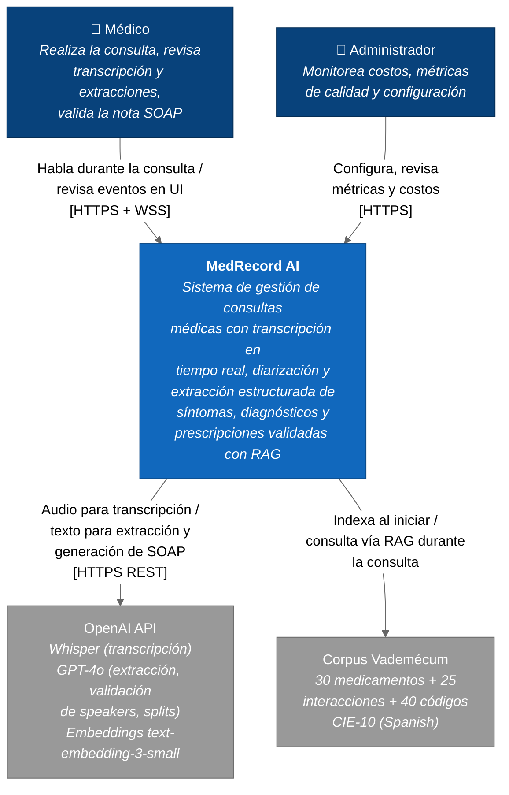

# C4 — Nivel 1: Contexto

**Sistema:** MedRecord AI
**Propósito:** Mostrar el sistema y los actores/sistemas externos con los que interactúa.

## Actores

| Actor | Rol |
|---|---|
| **Médico** | Usuario primario. Inicia sesión de transcripción, habla durante la consulta, revisa transcripción/extracciones en tiempo real, edita y guarda la nota SOAP. |
| **Administrador** | Monitorea costos por sesión y agregados (`/api/v1/costs/*`), revisa métricas de calidad RAG, ajusta thresholds de dedup y umbrales VAD. |

## Sistemas Externos

| Sistema | Uso | Modelos / Datos |
|---|---|---|
| **OpenAI API** | Transcripción + extracción + validación tipográfica + embeddings | `whisper-1`, `gpt-4o`, `gpt-4o-mini`, `text-embedding-3-small` |
| **Corpus Vademécum** | Conocimiento clínico para validación RAG (interacciones, posología, CIE-10) | `ai-service/data/vademecum/*.json` ingestado a ChromaDB |

## Notas

- El **paciente** no es un actor del sistema — su voz es procesada pero no interactúa con la UI.
- Las **bases de conocimiento médico** son provisionadas a tiempo de ingesta, no consultadas online (a diferencia del diseño C4 contexto del prompt 36 original).
- La autenticación es JWT-only, emitida por el Backend (no hay un IdP externo en el alcance actual).
