# Equivalencias Multi-Cloud — MedRecord AI

**Propósito:** Demostrar que la arquitectura es vendor-agnostic. La implementación actual corre sobre **Docker Compose en host único** (dev local) o **AWS EC2** (prod, ver `infrastructure/aws/`), pero cada componente tiene equivalentes inmediatos en GCP y Azure.

```mermaid
%%{init: {'theme':'neutral'}}%%
flowchart LR
    classDef cat fill:#1565C0,stroke:#0D47A1,color:#fff
    classDef aws fill:#FF9900,stroke:#CC7700,color:#000
    classDef gcp fill:#4285F4,stroke:#1A73E8,color:#fff
    classDef azure fill:#0078D4,stroke:#005A9E,color:#fff

    subgraph compute ["🖥️ COMPUTE"]
        direction LR
        c1["VM única + Docker"]:::cat --> caws1["EC2 t3.medium"]:::aws & cgcp1["Compute Engine<br/>e2-medium"]:::gcp & caz1["Azure VM B2s"]:::azure
        c2["Kubernetes managed"]:::cat --> caws2["EKS"]:::aws & cgcp2["GKE"]:::gcp & caz2["AKS"]:::azure
        c3["Containers serverless"]:::cat --> caws3["ECS Fargate"]:::aws & cgcp3["Cloud Run"]:::gcp & caz3["Container Apps"]:::azure
    end

    subgraph data ["💾 DATA"]
        direction LR
        d1["Postgres managed"]:::cat --> daws1["RDS PostgreSQL"]:::aws & dgcp1["Cloud SQL Postgres"]:::gcp & daz1["Azure DB for Postgres"]:::azure
        d2["Redis managed"]:::cat --> daws2["ElastiCache"]:::aws & dgcp2["Memorystore"]:::gcp & daz2["Azure Cache for Redis"]:::azure
        d3["Object storage"]:::cat --> daws3["S3"]:::aws & dgcp3["Cloud Storage"]:::gcp & daz3["Blob Storage"]:::azure
        d4["Vector DB managed<br/><i>(opcional vs ChromaDB self-hosted)</i>"]:::cat --> daws4["OpenSearch +<br/>k-NN"]:::aws & dgcp4["Vertex AI<br/>Vector Search"]:::gcp & daz4["AI Search<br/>Vector"]:::azure
    end

    subgraph sec ["🔐 SECURITY"]
        direction LR
        s1["Secrets"]:::cat --> saws1["Secrets Manager"]:::aws & sgcp1["Secret Manager"]:::gcp & saz1["Key Vault"]:::azure
        s2["Identity (humans)"]:::cat --> saws2["IAM + Cognito"]:::aws & sgcp2["IAM + Identity<br/>Platform"]:::gcp & saz2["Entra ID"]:::azure
        s3["TLS certs"]:::cat --> saws3["ACM"]:::aws & sgcp3["Certificate Manager"]:::gcp & saz3["Key Vault certs"]:::azure
    end

    subgraph obs ["📊 OBSERVABILITY"]
        direction LR
        o1["Logs + metrics"]:::cat --> oaws1["CloudWatch"]:::aws & ogcp1["Cloud Logging +<br/>Monitoring"]:::gcp & oaz1["Azure Monitor"]:::azure
        o2["APM / tracing"]:::cat --> oaws2["X-Ray"]:::aws & ogcp2["Cloud Trace"]:::gcp & oaz2["Application<br/>Insights"]:::azure
    end

    subgraph net ["🌐 NETWORKING"]
        direction LR
        n1["Load balancer + WS"]:::cat --> naws1["ALB"]:::aws & ngcp1["HTTPS LB"]:::gcp & naz1["App Gateway /<br/>Front Door"]:::azure
        n2["DNS"]:::cat --> naws2["Route 53"]:::aws & ngcp2["Cloud DNS"]:::gcp & naz2["Azure DNS"]:::azure
        n3["CDN"]:::cat --> naws3["CloudFront"]:::aws & ngcp3["Cloud CDN"]:::gcp & naz3["Azure CDN /<br/>Front Door"]:::azure
    end

    subgraph cicd ["🔧 CI/CD + IaC"]
        direction LR
        i1["CI/CD pipelines"]:::cat --> iaws1["CodePipeline +<br/>CodeBuild"]:::aws & igcp1["Cloud Build +<br/>Cloud Deploy"]:::gcp & iaz1["Azure DevOps /<br/>GitHub Actions"]:::azure
        i2["IaC <i>(actual)</i>"]:::cat --> terraform["Terraform — vendor-agnostic"]
    end
```

## Tabla de mapeo

| Componente arquitectónico | AWS | GCP | Azure | Implementación actual |
|---|---|---|---|---|
| **Frontend SPA hosting** | S3 + CloudFront | Cloud Storage + Cloud CDN | Static Web Apps | Servido por Nginx en EC2 (dev: contenedor) |
| **Reverse proxy / TLS** | ALB + ACM | HTTPS LB + Cert Manager | App Gateway + Key Vault | Nginx + Let's Encrypt (`infrastructure/aws/nginx/`) |
| **Backend API + WS** | EC2 / ECS / EKS | GCE / Cloud Run / GKE | VM / Container Apps / AKS | Docker container en EC2 / host local |
| **AI Service Python** | EC2 / ECS / EKS | GCE / Cloud Run / GKE | VM / Container Apps / AKS | Docker container; warm-up modelos al startup |
| **PostgreSQL** | RDS PostgreSQL | Cloud SQL PostgreSQL | Azure DB for PostgreSQL | Postgres 15 contenedor (`packages/backend/prisma/`) |
| **Redis** | ElastiCache | Memorystore | Azure Cache for Redis | Redis 7 contenedor |
| **Vector store** | OpenSearch k-NN | Vertex AI Vector Search | AI Search Vector | ChromaDB self-hosted (`ai-service/data/vademecum/`) |
| **Object storage (audios)** | S3 | Cloud Storage | Blob Storage | Volumen Docker / FS local en dev; S3 en prod |
| **Secrets** | Secrets Manager | Secret Manager | Key Vault | `.env` files (dev) → AWS Secrets Manager (prod) |
| **LLM API** | Bedrock (Claude/Titan) o OpenAI | Vertex AI (Gemini) o OpenAI | Azure OpenAI Service | OpenAI directo (`whisper-1`, `gpt-4o`, embeddings) |
| **Observabilidad** | CloudWatch + X-Ray | Cloud Logging + Trace | Monitor + App Insights | Pino (Node) + structlog (Python) → stdout / archivo |
| **CI/CD** | CodePipeline + CodeBuild | Cloud Build + Cloud Deploy | Azure DevOps | **GitHub Actions** (`.github/workflows/ci-cd.yml`, `security.yml`, `ragas-evaluation.yml`) |
| **IaC** | CloudFormation / CDK | Deployment Manager | ARM / Bicep | Terraform (`infrastructure/aws/terraform/`) |

## Notas de portabilidad

- **Costo de migración estimado: 2–3 días** (solo Terraform + variables de entorno; código de aplicación: 0 cambios).
- **OpenAI vs LLM cloud-native:** El código abstrae el cliente LLM en `ai-service/src/services/model_selector.py`; cambiar a Bedrock / Vertex AI / Azure OpenAI requiere cambiar solo las URLs base y credenciales (todos exponen un wire-protocol compatible con la API de OpenAI o un thin adapter).
- **ChromaDB vs vector DB managed:** ChromaDB es portable (volumen). Migrar a OpenSearch / Vertex Vector Search requiere reescribir el módulo `ai-service/src/rag/vector_store.py` (~150 LOC).
- **WebSocket sticky sessions:** En clouds con autoescalado horizontal se requiere sticky sessions en el LB (cookie `JSESSIONID` o session affinity por IP) o mover el estado a Redis (ya está parcialmente: speaker centroids + event buffer).

## Decisión actual

> **AWS EC2 t3.medium + Docker Compose** — un solo host, simplicidad operacional, suficiente para pilot y demos. La descomposición en servicios managed se difiere hasta superar el throughput de un nodo.
