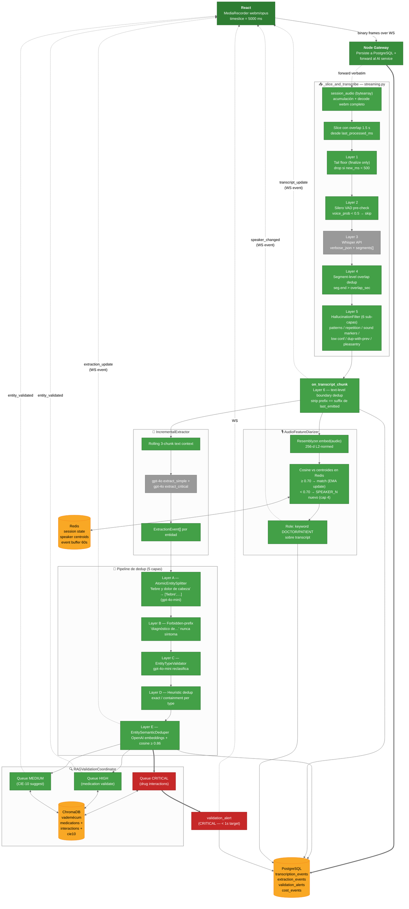

# Pipeline de Transcripción Real-Time — Diagrama de Componentes

**Propósito:** Mostrar las capas internas del AI Service que procesan audio streaming. Refleja el estado post-prompts 27.x descrito en [`streaming-transcription-architecture.md`](../streaming-transcription-architecture.md).

## Modelos cargados al startup (warm-up)

`ai-service/src/api/main.py`:

1. `silero_vad.load_silero_vad()` — VAD ~32 ms windows a 16 kHz.
2. `resemblyzer.VoiceEncoder()` — JIT inicial ~24 s (librosa+numba); subsiguientes < 50 ms.

Sin warm-up el primer slice tomaba > 30 s y disparaba timeouts del WebSocket en algunos navegadores.

## Targets de latencia

| Evento | Target | Medido típicamente |
|---|---|---|
| `transcript_update` (desde fin de habla a UI) | < 2 s | ~1.2-1.8 s |
| `extraction_update` | < 3 s | ~2-2.5 s |
| `validation_alert` (CRITICAL — drug interaction) | < 1 s desde extracción | ~0.4-0.8 s |
| Reconexión + replay (event buffer 60 s) | < 5 s | ~1-3 s |

## Persistencia y reconexión

- **Cada evento** emitido al cliente se escribe a PostgreSQL (Backend, `event-persistence.service.ts`) **y** se buffer-ea en Redis con TTL 60 s.
- En desconexión, el cliente reconecta con `last_event_id`; el Backend replica los eventos faltantes desde Redis (rápido) o desde PostgreSQL (fallback si pasaron > 60 s).

## Costos (resumen)

Tracker: `services/cost_tracker.py`. Por sesión típica de 15 min:
- Whisper: ~$0.09 (15 min × $0.006/min)
- GPT-4o extracción: ~$0.05–0.15 (depende de cantidad de entidades)
- GPT-4o-mini (splitter + type validator): ~$0.005
- Embeddings (semantic dedup + RAG): ~$0.001
- **Total ~$0.15–0.25 por consulta de 15 min.**
