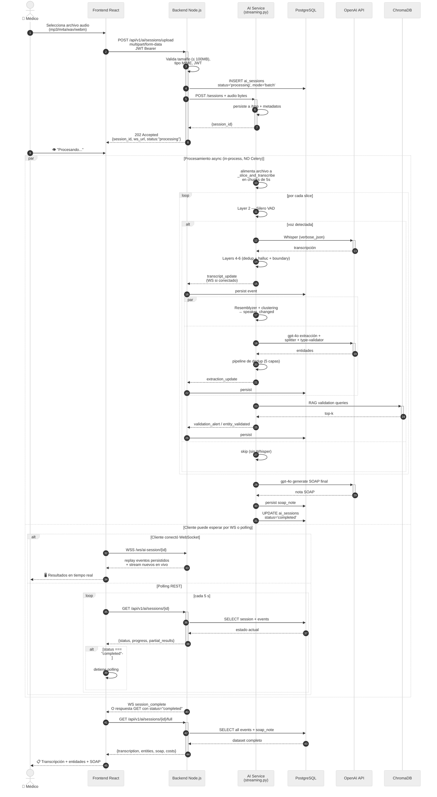

# Diagrama de Secuencia — Flujo Batch (subida de audio)

**Propósito:** Mostrar el flujo alternativo donde el médico sube un archivo de audio completo después de la consulta, en lugar de transmitir en tiempo real.

> **Nota:** A diferencia del diseño original (Prompt 36), **no hay Celery worker**. El batch reutiliza la misma infraestructura del pipeline streaming: el AI Service alimenta el archivo a través del mismo `_slice_and_transcribe` y emite eventos. El cliente puede consumirlos por WebSocket (preferido) o hacer polling REST.

## Diferencias con el flujo real-time

| Aspecto | Real-time | Batch |
|---|---|---|
| Origen del audio | MediaRecorder webm/opus, 5 s timeslice | Archivo completo subido vía REST |
| Disparador | `audio` events sobre WS | POST a `/sessions/upload` |
| Latencia percibida | < 2 s por chunk | ~tiempo total de audio × 0.3-0.5 |
| Notificación al cliente | WebSocket (primario) | WebSocket o polling REST |
| `finalize` | Mensaje WS explícito | Implícito al terminar el archivo |
| Persistencia | Idéntica (mismos `*_events`) | Idéntica |

## Endpoints REST involucrados

| Método | Ruta | Propósito |
|---|---|---|
| `POST` | `/api/v1/ai/sessions/upload` | Crear sesión + subir audio (multipart) |
| `GET` | `/api/v1/ai/sessions/{id}` | Estado actual + progreso |
| `GET` | `/api/v1/ai/sessions/{id}/full` | Dataset completo cuando `status=completed` |
| `DELETE` | `/api/v1/ai/sessions/{id}` | Cierre / limpieza |

> Ver [`ai_service_contract.md`](../../../memory/ai_service_contract.md) para detalles del contrato real (JWT-only, no `/auth/token`, no `/finalize`).
