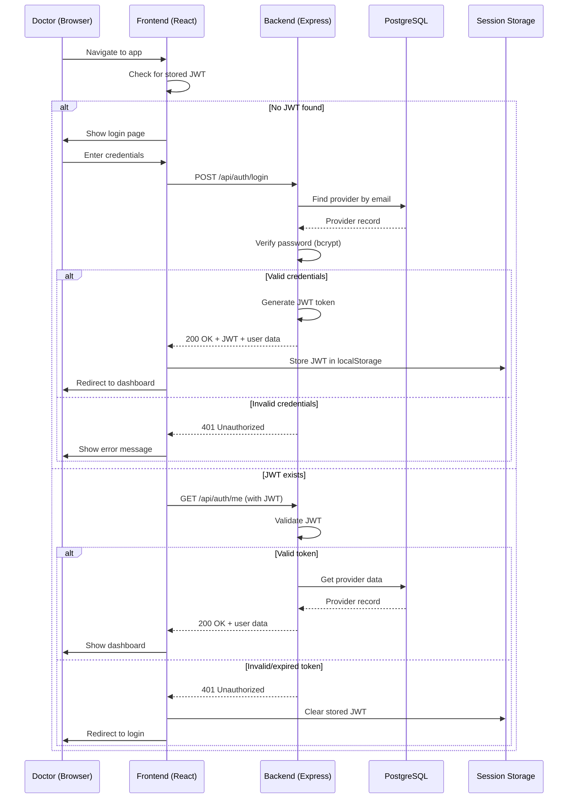
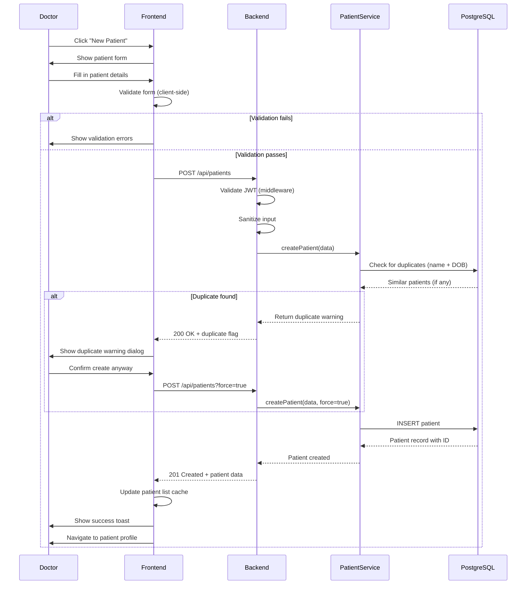
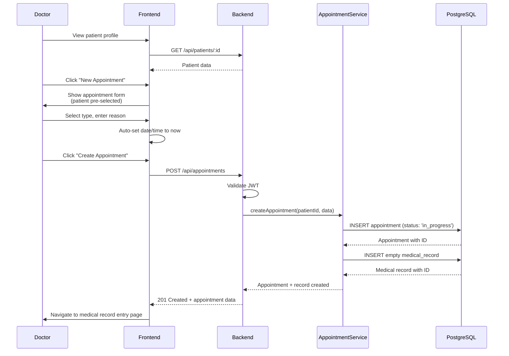
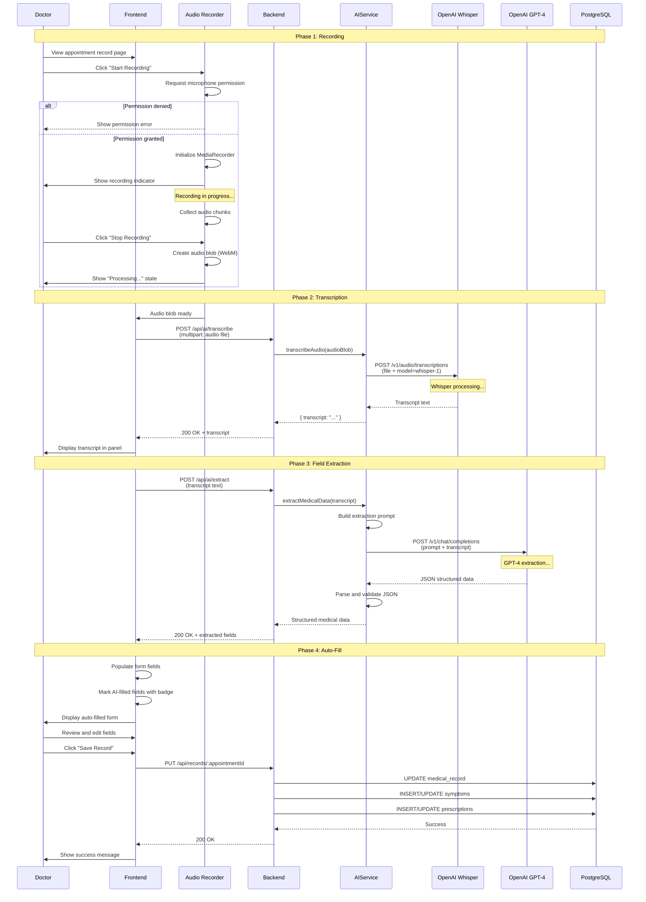
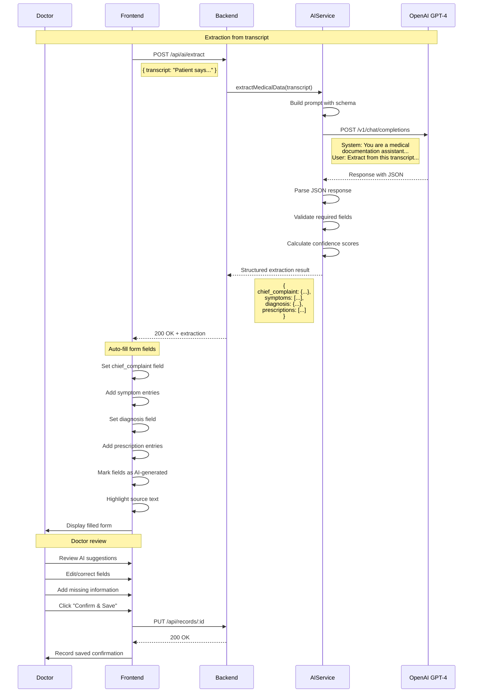
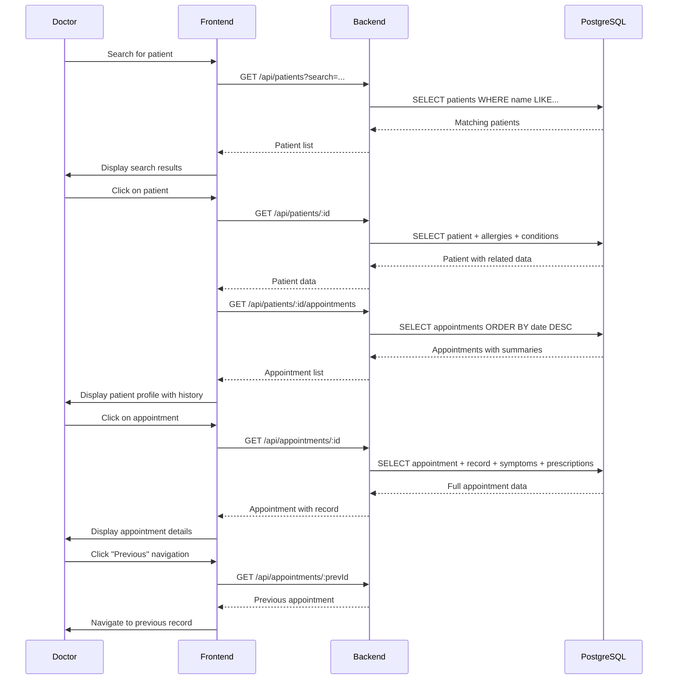
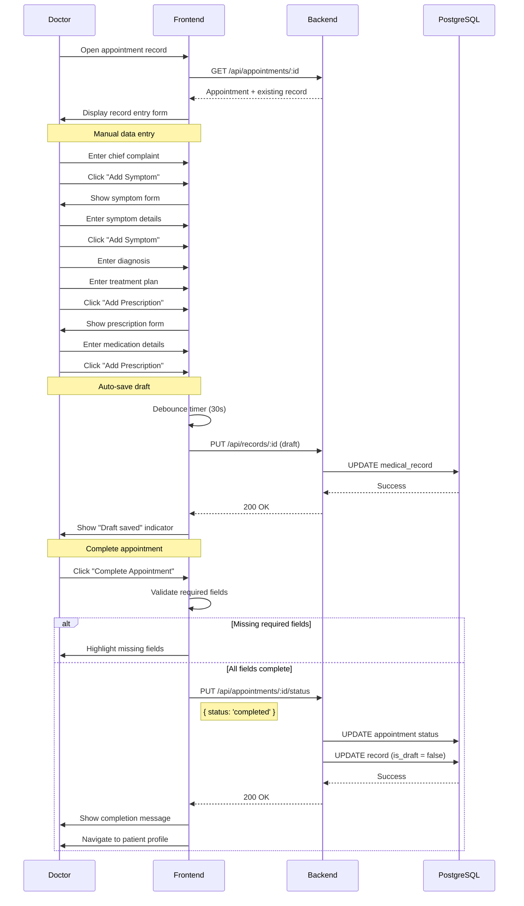
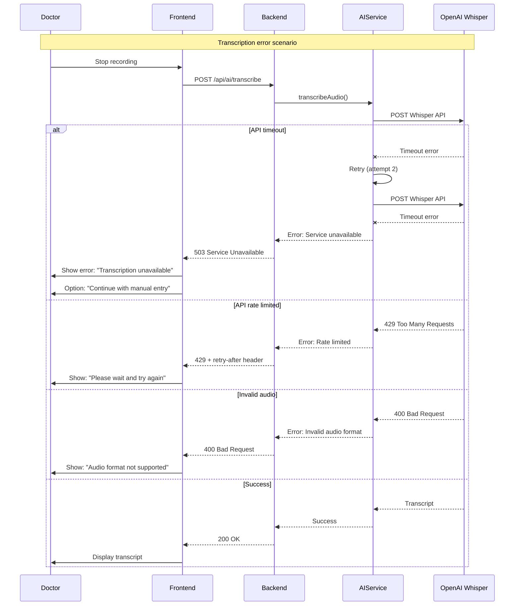

# Sequence Diagrams

This document contains sequence diagrams for the key flows in MedRecord AI MVP.

---

## 1. User Authentication Flow



---

## 2. Patient Registration Flow



---

## 3. Create Appointment Flow



---

## 4. AI Transcription Flow (Most Complex)



---

## 5. Auto-Fill Medical Record Flow



---

## 6. View Patient History Flow



---

## 7. Manual Record Entry Flow



---

## 8. Error Handling Flow



---

## Legend

```
Participant Types:
- U: User (Doctor)
- F: Frontend (React)
- B: Backend (Express)
- DB: Database (PostgreSQL)
- AI: AI Service layer
- W: Whisper API (OpenAI)
- G: GPT-4 API (OpenAI)

Line Types:
─────> : Synchronous call
──────>>: Async response
──x──> : Error/failure
─ ─ ─> : Optional/conditional

Notes:
- All API calls include JWT authentication (omitted for clarity)
- Error handling simplified for readability
- Database operations abstracted through Prisma
```
