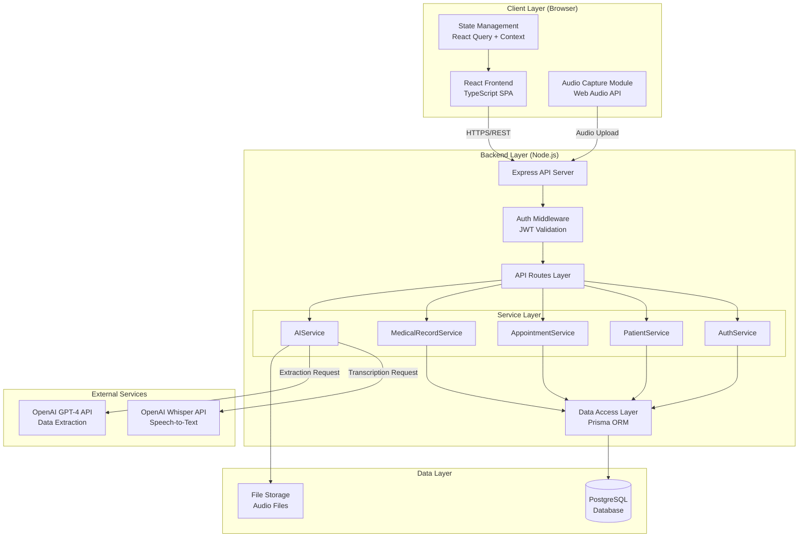
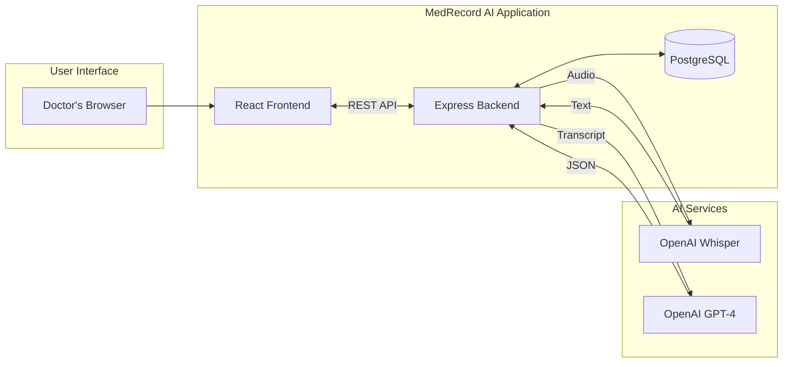
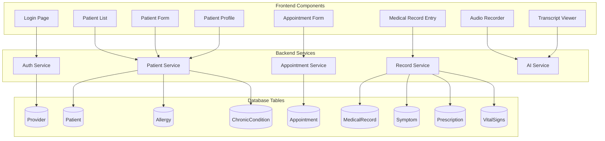
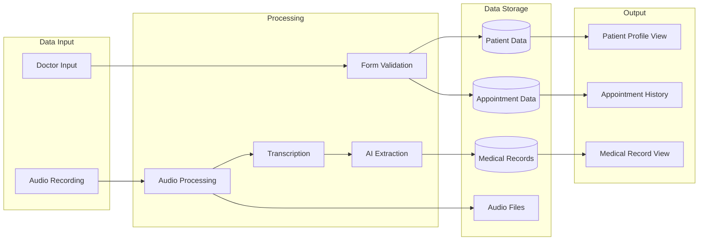
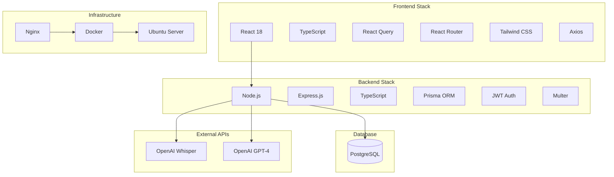
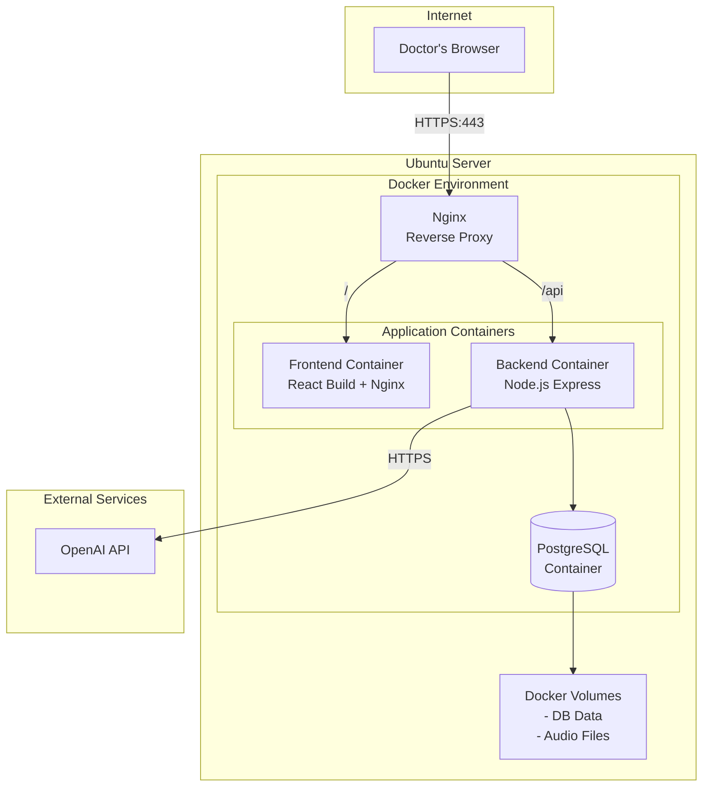
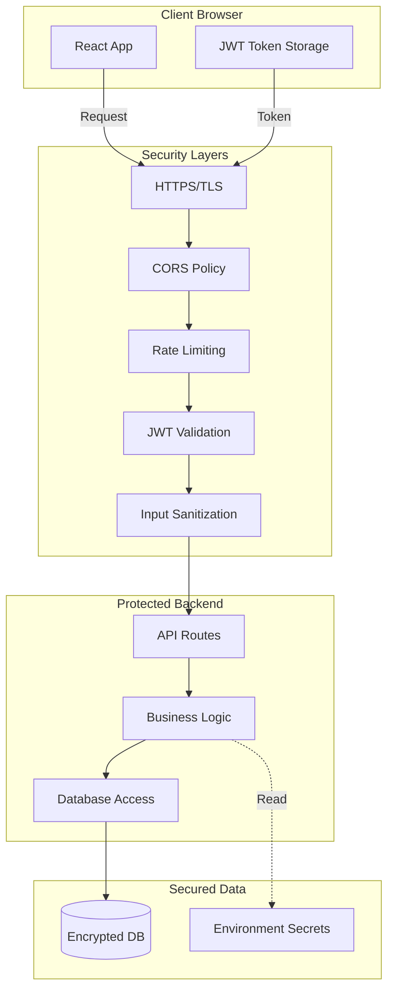
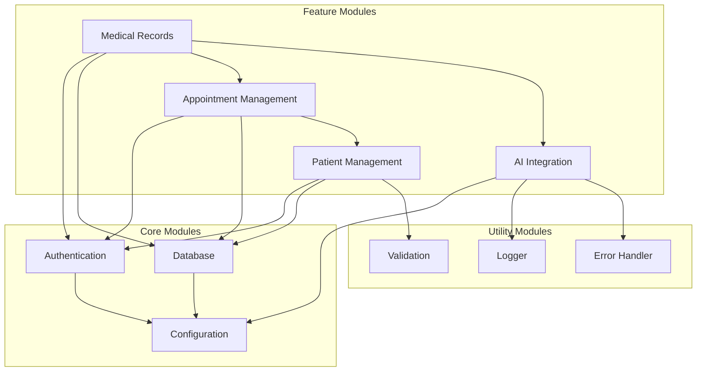

# System Architecture Diagram

## Main Architecture Diagram

## Simplified Overview Diagram

## Component Interaction Diagram

## Data Flow Diagram

## Technology Stack Diagram

## Deployment Architecture Diagram

## Security Architecture Diagram

## Module Dependencies Diagram

