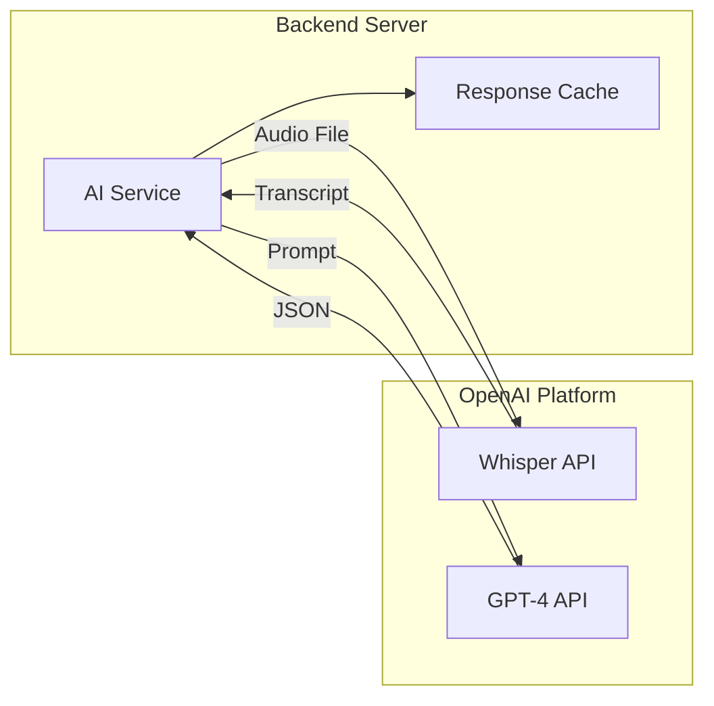
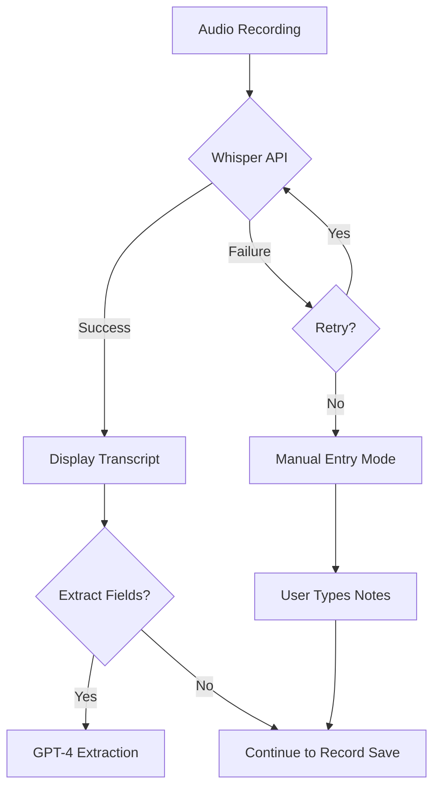

# Integration Architecture: MedRecord AI

This document details the integration architecture for external services and real-time communication patterns.

---

## AI Service Integration

### Overview

MedRecord AI integrates with OpenAI APIs for two primary functions:
1. **Speech-to-Text**: OpenAI Whisper API for transcription
2. **Data Extraction**: OpenAI GPT-4 API for structured field extraction



---

## OpenAI Whisper API Integration

### Configuration

| Setting | Value | Rationale |
|---------|-------|-----------|
| Model | `whisper-1` | Current production model |
| Language | `en` | English-only for MVP |
| Response Format | `text` | Plain text sufficient |
| File Size Limit | 25 MB | OpenAI limit |
| Supported Formats | mp3, mp4, webm, wav | Using webm |

### API Endpoint

```
POST https://api.openai.com/v1/audio/transcriptions
```

### Request Format

```typescript
// Request (multipart/form-data)
{
  file: <audio file>,
  model: "whisper-1",
  language: "en",
  response_format: "text"
}

// Response
"Patient came in today complaining of persistent headache..."
```

### Implementation

```typescript
// services/ai.service.ts
import OpenAI from 'openai';
import { createReadStream } from 'fs';
import { writeFile, unlink } from 'fs/promises';
import { join } from 'path';
import { v4 as uuid } from 'uuid';

const openai = new OpenAI({
  apiKey: process.env.OPENAI_API_KEY,
  timeout: 120000, // 2 minutes for large files
  maxRetries: 2,
});

interface TranscriptionResult {
  transcript: string;
  duration: number;
}

export async function transcribeAudio(
  audioBuffer: Buffer,
  mimeType: string
): Promise<TranscriptionResult> {
  const startTime = Date.now();

  // Write buffer to temp file (OpenAI SDK requires file path)
  const tempPath = join('/tmp', `audio-${uuid()}.webm`);
  await writeFile(tempPath, audioBuffer);

  try {
    const response = await openai.audio.transcriptions.create({
      file: createReadStream(tempPath),
      model: 'whisper-1',
      language: 'en',
      response_format: 'text',
    });

    return {
      transcript: response,
      duration: Date.now() - startTime,
    };
  } finally {
    // Clean up temp file
    await unlink(tempPath).catch(() => {});
  }
}
```

### Audio Processing Pipeline

```
Browser Recording → Backend Upload → Temp File → Whisper API → Transcript
      │                 │               │            │            │
  WebM/Opus        multipart/       Write to     POST with    Return text
   format          form-data          /tmp       file stream
```

### Audio Quality Guidelines

| Requirement | Recommendation |
|-------------|----------------|
| Sample Rate | 44.1 kHz |
| Channels | Mono |
| Codec | Opus (in WebM container) |
| Noise | Enable `noiseSuppression: true` |
| Echo | Enable `echoCancellation: true` |
| Max Duration | 60 minutes |
| Max File Size | < 25 MB |

---

## OpenAI GPT-4 API Integration

### Configuration

| Setting | Value | Rationale |
|---------|-------|-----------|
| Model | `gpt-4` | Best extraction accuracy |
| Temperature | 0.3 | Lower for consistency |
| Response Format | JSON | Structured output |
| Max Tokens | 2000 | Sufficient for extraction |
| Timeout | 60 seconds | Reasonable for extraction |

### API Endpoint

```
POST https://api.openai.com/v1/chat/completions
```

### Request Format

```typescript
// Request
{
  model: "gpt-4",
  messages: [
    { role: "system", content: SYSTEM_PROMPT },
    { role: "user", content: EXTRACTION_PROMPT + transcript }
  ],
  temperature: 0.3,
  response_format: { type: "json_object" }
}

// Response
{
  chiefComplaint: "Persistent headache for 3 days",
  symptoms: [...],
  diagnosis: "Tension headache",
  prescriptions: [...]
}
```

### Extraction Prompt Engineering

```typescript
// System prompt
const SYSTEM_PROMPT = `You are a medical documentation assistant specializing in
extracting structured information from doctor-patient conversation transcripts.

Your task is to identify and extract medical information accurately.
Only extract information that is explicitly stated or clearly implied.
Use null for any information that is not mentioned.
Be conservative - do not infer or assume information.

Always respond with valid JSON matching the requested schema.`;

// User prompt template
const EXTRACTION_PROMPT = `Extract medical information from the following
doctor-patient conversation transcript.

Return a JSON object with this exact structure:
{
  "chiefComplaint": "Primary reason for visit (string or null)",
  "historyOfPresentIllness": "Detailed description of current illness (string or null)",
  "symptoms": [
    {
      "name": "Symptom name (required)",
      "severity": "1-10 scale (number or null)",
      "duration": "How long (string or null)",
      "bodySite": "Location on body (string or null)",
      "notes": "Additional details (string or null)"
    }
  ],
  "diagnosis": "Primary diagnosis stated by doctor (string or null)",
  "diagnosisNotes": "Additional diagnostic notes (string or null)",
  "treatmentPlan": "Treatment approach (string or null)",
  "prescriptions": [
    {
      "medicationName": "Drug name (required)",
      "strength": "Dose strength (required)",
      "dosage": "Amount per dose (required)",
      "frequency": "How often (required)",
      "duration": "How long to take (string or null)",
      "instructions": "Patient instructions (required)"
    }
  ],
  "followUp": "Follow-up instructions (string or null)",
  "allergiesNoted": ["Any allergies mentioned"],
  "currentMedications": ["Any current medications mentioned"]
}

TRANSCRIPT:
`;
```

### Implementation

```typescript
// services/ai.service.ts
interface ExtractedMedicalData {
  chiefComplaint: string | null;
  historyOfPresentIllness: string | null;
  symptoms: ExtractedSymptom[];
  diagnosis: string | null;
  diagnosisNotes: string | null;
  treatmentPlan: string | null;
  prescriptions: ExtractedPrescription[];
  followUp: string | null;
  allergiesNoted: string[];
  currentMedications: string[];
}

interface ExtractedSymptom {
  name: string;
  severity: number | null;
  duration: string | null;
  bodySite: string | null;
  notes: string | null;
}

interface ExtractedPrescription {
  medicationName: string;
  strength: string;
  dosage: string;
  frequency: string;
  duration: string | null;
  instructions: string;
}

export async function extractMedicalData(
  transcript: string
): Promise<ExtractedMedicalData> {
  const response = await openai.chat.completions.create({
    model: 'gpt-4',
    messages: [
      { role: 'system', content: SYSTEM_PROMPT },
      { role: 'user', content: EXTRACTION_PROMPT + transcript },
    ],
    temperature: 0.3,
    response_format: { type: 'json_object' },
    max_tokens: 2000,
  });

  const content = response.choices[0].message.content;
  if (!content) {
    throw new Error('Empty response from GPT-4');
  }

  const parsed = JSON.parse(content) as ExtractedMedicalData;

  // Validate required fields in arrays
  validateExtraction(parsed);

  return parsed;
}

function validateExtraction(data: ExtractedMedicalData): void {
  // Ensure symptoms have required name field
  data.symptoms = data.symptoms.filter((s) => s.name && s.name.trim());

  // Ensure prescriptions have all required fields
  data.prescriptions = data.prescriptions.filter(
    (p) =>
      p.medicationName &&
      p.strength &&
      p.dosage &&
      p.frequency &&
      p.instructions
  );
}
```

---

## Rate Limiting Considerations

### OpenAI Rate Limits

| Tier | Whisper | GPT-4 | Notes |
|------|---------|-------|-------|
| Free | 3 RPM | 3 RPM | Very limited |
| Tier 1 | 50 RPM | 500 RPM | ~$5 paid |
| Tier 2 | 100 RPM | 5000 RPM | ~$50 paid |

**MVP Approach**: Tier 1 sufficient for single-doctor use.

### Backend Rate Limiting

```typescript
// middleware/rateLimit.middleware.ts
import rateLimit from 'express-rate-limit';

// General API rate limit
export const apiLimiter = rateLimit({
  windowMs: 60 * 1000, // 1 minute
  max: 100, // 100 requests per minute
  message: { error: 'Too many requests, please try again later' },
});

// AI endpoints - more restrictive
export const aiLimiter = rateLimit({
  windowMs: 60 * 1000, // 1 minute
  max: 10, // 10 AI requests per minute
  message: { error: 'AI processing limit reached, please wait' },
});

// Apply in routes
app.use('/api', apiLimiter);
app.use('/api/ai', aiLimiter);
```

### Request Queuing (Optional Enhancement)

```typescript
// For handling bursts of AI requests
import PQueue from 'p-queue';

const aiQueue = new PQueue({
  concurrency: 2, // Max 2 concurrent AI requests
  interval: 1000,
  intervalCap: 3, // Max 3 per second
});

export async function queueTranscription(audioBuffer: Buffer): Promise<string> {
  return aiQueue.add(() => transcribeAudio(audioBuffer, 'audio/webm'));
}
```

---

## Error Handling Approach

### Error Categories

| Error Type | HTTP Status | Handling |
|------------|-------------|----------|
| Rate Limited | 429 | Retry with backoff |
| Invalid Audio | 400 | Return user-friendly message |
| API Timeout | 504 | Retry once, then manual fallback |
| API Error | 502 | Log, retry, fallback |
| Parse Error | 500 | Return partial data if possible |

### Retry Strategy

```typescript
// utils/retry.ts
interface RetryOptions {
  maxRetries: number;
  baseDelay: number;
  maxDelay: number;
}

export async function withRetry<T>(
  fn: () => Promise<T>,
  options: RetryOptions = { maxRetries: 2, baseDelay: 1000, maxDelay: 5000 }
): Promise<T> {
  let lastError: Error;

  for (let attempt = 0; attempt <= options.maxRetries; attempt++) {
    try {
      return await fn();
    } catch (error) {
      lastError = error as Error;

      if (attempt < options.maxRetries) {
        const delay = Math.min(
          options.baseDelay * Math.pow(2, attempt),
          options.maxDelay
        );
        await sleep(delay);
      }
    }
  }

  throw lastError!;
}
```

### Error Response Format

```typescript
// Standardized error response
interface AIErrorResponse {
  success: false;
  error: {
    code: string;
    message: string;
    retryable: boolean;
    fallbackAvailable: boolean;
  };
}

// Example responses
{
  success: false,
  error: {
    code: "TRANSCRIPTION_FAILED",
    message: "Unable to transcribe audio. Please try again or enter notes manually.",
    retryable: true,
    fallbackAvailable: true
  }
}

{
  success: false,
  error: {
    code: "EXTRACTION_PARTIAL",
    message: "Some fields could not be extracted. Please review and complete manually.",
    retryable: false,
    fallbackAvailable: true
  }
}
```

---

## Fallback Strategies

### Transcription Fallback



### Extraction Fallback

```typescript
// Partial extraction handling
interface ExtractionResult {
  success: boolean;
  data: Partial<ExtractedMedicalData>;
  warnings: string[];
  requiresManualReview: boolean;
}

export async function safeExtractMedicalData(
  transcript: string
): Promise<ExtractionResult> {
  try {
    const data = await extractMedicalData(transcript);
    return {
      success: true,
      data,
      warnings: [],
      requiresManualReview: false,
    };
  } catch (error) {
    // Log error for debugging
    logger.error('Extraction failed', { error, transcriptLength: transcript.length });

    // Return empty structure for manual entry
    return {
      success: false,
      data: {
        chiefComplaint: null,
        symptoms: [],
        diagnosis: null,
        prescriptions: [],
      },
      warnings: ['AI extraction unavailable. Please enter information manually.'],
      requiresManualReview: true,
    };
  }
}
```

---

## Real-Time Communication

### Decision: REST Polling vs WebSocket

| Factor | REST Polling | WebSocket |
|--------|-------------|-----------|
| Implementation | Simple | Complex |
| Server Resources | Higher (repeated requests) | Lower (persistent connection) |
| Latency | Polling interval | Near real-time |
| MVP Fit | Better | Over-engineering |
| Browser Support | Universal | Universal (but more complex) |

**Decision**: Use REST for MVP. Processing happens in single request-response cycle.

### Current Flow (POST-based)

```
1. Client uploads audio → POST /api/ai/transcribe
2. Server processes with Whisper (30-60 seconds)
3. Server returns transcript in same response
4. Client sends transcript → POST /api/ai/extract
5. Server processes with GPT-4 (5-15 seconds)
6. Server returns structured data in same response
```

### Processing Status Feedback

Since AI processing can take time, we provide status feedback:

```typescript
// Frontend status states
type ProcessingStatus =
  | 'idle'
  | 'uploading'
  | 'transcribing'
  | 'extracting'
  | 'complete'
  | 'error';

// UI shows appropriate message for each state
const STATUS_MESSAGES = {
  idle: '',
  uploading: 'Uploading recording...',
  transcribing: 'Transcribing conversation... This may take up to a minute.',
  extracting: 'Extracting medical information...',
  complete: 'Processing complete!',
  error: 'Processing failed. You can enter information manually.',
};
```

### Future Enhancement: Streaming (Phase 2)

For real-time transcription in the future:

```typescript
// Future: Server-Sent Events for progress
app.get('/api/ai/transcribe-stream', async (req, res) => {
  res.setHeader('Content-Type', 'text/event-stream');
  res.setHeader('Cache-Control', 'no-cache');

  // Send progress updates
  res.write(`data: ${JSON.stringify({ status: 'processing', progress: 0 })}\n\n`);

  // ... processing ...

  res.write(`data: ${JSON.stringify({ status: 'complete', transcript })}\n\n`);
  res.end();
});
```

---

## Client-Server Sync Approach

### Data Consistency

| Pattern | Implementation |
|---------|----------------|
| Optimistic Updates | Update UI immediately, sync with server |
| Server Authority | Server response is source of truth |
| Auto-Save Drafts | Periodic saves every 30 seconds |
| Conflict Resolution | Last-write-wins (single user MVP) |

### Auto-Save Implementation

```typescript
// Frontend: useAutoSave hook
function useAutoSave(
  appointmentId: string,
  formData: MedicalRecordFormData,
  interval = 30000
) {
  const mutation = useMutation(saveRecordDraft);

  useEffect(() => {
    const timer = setInterval(() => {
      if (formData.isDirty) {
        mutation.mutate({ appointmentId, data: formData });
      }
    }, interval);

    return () => clearInterval(timer);
  }, [appointmentId, formData, interval]);

  return { isSaving: mutation.isLoading };
}
```

### Request/Response Patterns

```typescript
// API response format
interface ApiResponse<T> {
  success: boolean;
  data?: T;
  error?: {
    code: string;
    message: string;
  };
  meta?: {
    timestamp: string;
    requestId: string;
  };
}

// Example: Save record response
{
  success: true,
  data: {
    id: "rec_123",
    appointmentId: "apt_456",
    updatedAt: "2024-02-20T10:30:00Z",
    isDraft: true
  },
  meta: {
    timestamp: "2024-02-20T10:30:00Z",
    requestId: "req_789"
  }
}
```

---

## API Cost Management

### Cost Tracking

```typescript
// Log API usage for cost monitoring
interface APIUsageLog {
  timestamp: Date;
  endpoint: 'whisper' | 'gpt4';
  inputSize: number; // bytes for audio, tokens for text
  responseSize: number;
  duration: number;
  estimatedCost: number;
}

async function logAPIUsage(usage: APIUsageLog): Promise<void> {
  logger.info('API Usage', usage);
  // Could also store in database for reporting
}
```

### Cost Estimates

| Operation | Input | Estimated Cost |
|-----------|-------|----------------|
| Whisper (15 min audio) | ~15 MB | $0.09 |
| GPT-4 (2000 tokens in, 500 out) | ~2500 tokens | $0.10 |
| **Total per appointment** | | **~$0.20** |

### Budget Controls

```typescript
// Optional: Monthly budget check
const MONTHLY_BUDGET = 50; // $50/month

async function checkBudget(): Promise<boolean> {
  const currentMonthUsage = await getMonthlyUsage();
  return currentMonthUsage < MONTHLY_BUDGET;
}
```

---

## Integration Testing

### Mock Services for Testing

```typescript
// __mocks__/openai.ts
export const mockTranscribe = jest.fn().mockResolvedValue({
  text: 'Patient reports headache for three days...',
});

export const mockExtract = jest.fn().mockResolvedValue({
  choices: [{
    message: {
      content: JSON.stringify({
        chiefComplaint: 'Headache for 3 days',
        symptoms: [{ name: 'Headache', severity: 6, duration: '3 days' }],
        diagnosis: 'Tension headache',
        prescriptions: [],
      }),
    },
  }],
});
```

### Integration Test Example

```typescript
describe('AI Integration', () => {
  it('should transcribe audio and extract fields', async () => {
    const audioBuffer = await readFile('test-fixtures/sample-audio.webm');

    const transcribeRes = await request(app)
      .post('/api/ai/transcribe')
      .attach('audio', audioBuffer, 'recording.webm')
      .expect(200);

    expect(transcribeRes.body.transcript).toBeTruthy();

    const extractRes = await request(app)
      .post('/api/ai/extract')
      .send({ transcript: transcribeRes.body.transcript })
      .expect(200);

    expect(extractRes.body.chiefComplaint).toBeTruthy();
  });
});
```

---

## References

- [OpenAI Whisper API Documentation](https://platform.openai.com/docs/api-reference/audio)
- [OpenAI Chat Completions API](https://platform.openai.com/docs/api-reference/chat)
- [High-Level Architecture](./high-level-architecture.md)
- [Sequence Diagrams](./diagrams/sequence-diagrams.md)
- [AI Transcription Research](../research/ai-transcription-approach.md)
