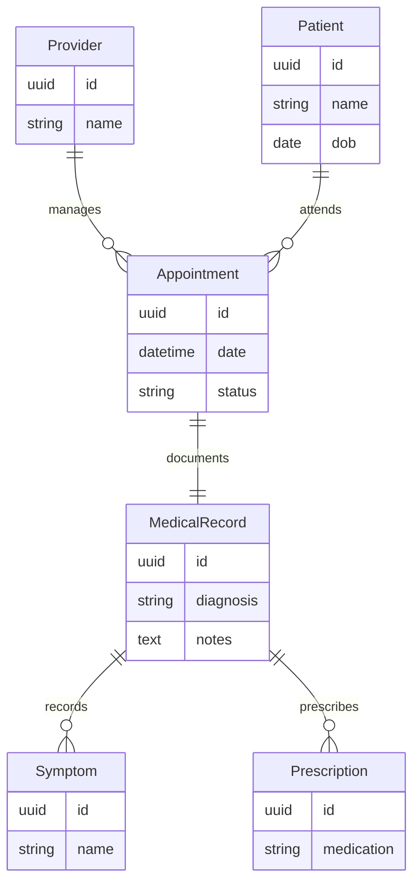
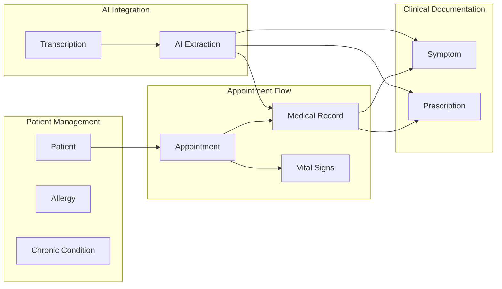

# Entity-Relationship Diagram

## Complete ER Diagram

```mermaid
erDiagram
    Provider ||--o{ Appointment : creates
    Patient ||--o{ Appointment : has
    Patient ||--o{ Allergy : has
    Patient ||--o{ ChronicCondition : has
    Appointment ||--|| MedicalRecord : contains
    Appointment ||--o| VitalSigns : has
    MedicalRecord ||--o{ Symptom : includes
    MedicalRecord ||--o{ Prescription : includes

    Provider {
        uuid id PK
        string email UK
        string passwordHash
        string firstName
        string lastName
        string specialty
        string licenseNumber
        string phone
        datetime createdAt
        datetime updatedAt
    }

    Patient {
        uuid id PK
        string firstName
        string lastName
        date dateOfBirth
        enum sex
        string phone
        string email
        string address
        string emergencyContactName
        string emergencyContactPhone
        string emergencyContactRelationship
        datetime createdAt
        datetime updatedAt
    }

    Allergy {
        uuid id PK
        uuid patientId FK
        string allergen
        string reaction
        enum severity
        date onsetDate
        datetime createdAt
    }

    ChronicCondition {
        uuid id PK
        uuid patientId FK
        string conditionName
        date diagnosisDate
        string status
        text notes
        datetime createdAt
    }

    Appointment {
        uuid id PK
        uuid patientId FK
        uuid providerId FK
        datetime appointmentDate
        enum appointmentType
        string reasonForVisit
        int durationMinutes
        enum status
        datetime createdAt
        datetime updatedAt
    }

    MedicalRecord {
        uuid id PK
        uuid appointmentId FK UK
        string chiefComplaint
        text historyOfPresentIllness
        text physicalExamNotes
        string diagnosis
        text diagnosisNotes
        text treatmentPlan
        text followUpInstructions
        text patientEducation
        string audioFileUrl
        text transcript
        boolean isAIGenerated
        boolean isDraft
        datetime createdAt
        datetime updatedAt
    }

    Symptom {
        uuid id PK
        uuid medicalRecordId FK
        string symptomName
        string bodySite
        int severity
        string duration
        text notes
        boolean isAIExtracted
        datetime createdAt
    }

    Prescription {
        uuid id PK
        uuid medicalRecordId FK
        string medicationName
        string strength
        string dosage
        string frequency
        string duration
        int quantity
        int refills
        text instructions
        string indication
        boolean isAIExtracted
        datetime createdAt
    }

    VitalSigns {
        uuid id PK
        uuid appointmentId FK UK
        int bloodPressureSystolic
        int bloodPressureDiastolic
        int heartRate
        decimal temperature
        int respiratoryRate
        int oxygenSaturation
        decimal weight
        decimal height
        decimal bmi
        int painLevel
        datetime recordedAt
    }
```

---

## Simplified Relationship View



---

## Relationship Legend

| Symbol | Meaning |
|--------|---------|
| `\|\|` | Exactly one (mandatory) |
| `o\|` | Zero or one (optional) |
| `o{` | Zero or many |
| `\|{` | One or many (at least one) |
| `PK` | Primary Key |
| `FK` | Foreign Key |
| `UK` | Unique Key |

---

## Entity Cardinalities

| Entity A | Relationship | Entity B | Cardinality |
|----------|--------------|----------|-------------|
| Provider | creates | Appointment | 1:N |
| Patient | has | Appointment | 1:N |
| Patient | has | Allergy | 1:N |
| Patient | has | ChronicCondition | 1:N |
| Appointment | contains | MedicalRecord | 1:1 |
| Appointment | has | VitalSigns | 1:0..1 |
| MedicalRecord | includes | Symptom | 1:N |
| MedicalRecord | includes | Prescription | 1:N |

---

## Data Flow Diagram



---

## References

- [ER Design Documentation](../er-design.md)
- [Prisma Schema](../prisma-schema.md)
