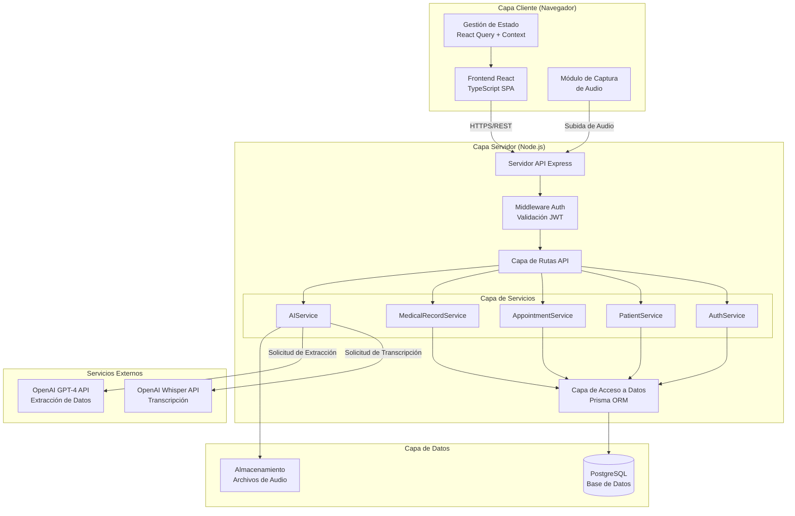
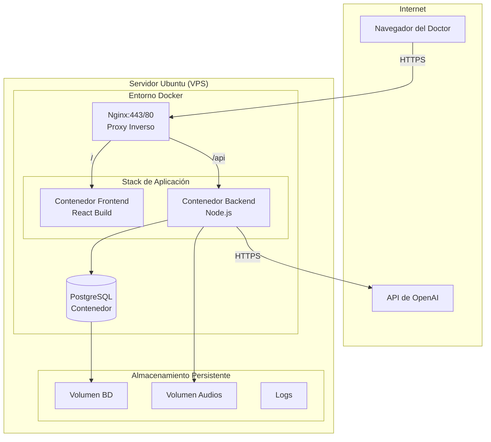

# 2. Arquitectura del Sistema

## 2.1. Diagrama de arquitectura



**Patrón arquitectónico**: Arquitectura Monolítica en Capas con Límites de Servicio

**Justificación**:
Se seleccionó una arquitectura monolítica en capas porque:
1. **Velocidad de desarrollo**: Un único código base permite iteración rápida, ideal para un proyecto MVP con tiempo limitado
2. **Simplicidad operacional**: Despliegue simple en un único servidor Ubuntu, reduciendo la complejidad de infraestructura
3. **Depuración eficiente**: Debugging directo sin la complejidad de sistemas distribuidos
4. **Costo optimizado**: Hosting económico (~$24/mes) al ejecutar todos los servicios en un servidor
5. **Preparado para escalar**: Los límites claros entre servicios permiten evolución hacia microservicios si es necesario

**Beneficios**:
- Desarrollo y despliegue rápido para cumplir plazos del proyecto
- Mantenimiento simplificado con todo el código en un repositorio
- Costos de infraestructura reducidos para fase MVP
- Fácil onboarding para nuevos desarrolladores
- Debugging y logging centralizado
- Transacciones de base de datos simples sin coordinación distribuida

**Trade-offs**:
- Escalabilidad horizontal limitada (aceptable para MVP de un solo doctor)
- Componentes acoplados (mitigado con límites de servicio claros)
- Punto único de fallo (aceptable para demostración/MVP)
- Requiere refactorización para multi-tenancy verdadero

---

## 2.2. Descripción de componentes principales

### Frontend (React/TypeScript)

El frontend es una Single Page Application (SPA) construida con React 18 y TypeScript, proporcionando una interfaz de usuario moderna y responsive.

**Responsabilidades**:
- Renderizado de interfaz de usuario e interacciones
- Enrutamiento del lado del cliente con React Router
- Validación de formularios y feedback al usuario
- Captura de audio mediante Web Audio API
- Gestión de estado con React Query (estado del servidor) y Context (estado de aplicación)
- Comunicación con la API mediante cliente HTTP (Axios)

**Estructura de Componentes Principales**:
| Componente | Propósito |
|------------|-----------|
| Páginas de Autenticación | Login, logout, gestión de sesión |
| Páginas de Pacientes | Listado, creación, edición, perfil |
| Páginas de Citas | Creación y visualización de citas |
| Páginas de Registro Médico | Entrada de datos, transcripción IA, grabación |
| Módulo de Audio | Control de grabación, visualización de waveform |
| Panel de Transcripción | Visualización de texto transcrito |

**Tecnologías**:
- React 18 con Hooks
- TypeScript 5 para type safety
- Vite como build tool
- Tailwind CSS para estilos
- React Query para estado del servidor
- React Hook Form + Zod para formularios

### Backend (Node.js/Express)

El backend es un servidor API RESTful construido con Node.js y Express, implementando la lógica de negocio y orquestando las integraciones.

**Responsabilidades**:
- Manejo de peticiones/respuestas HTTP
- Validación y sanitización de entrada
- Autenticación y autorización con JWT
- Lógica de negocio en capa de servicios
- Integración con APIs de IA (OpenAI)
- Acceso a datos mediante Prisma ORM

**Estructura de Capas**:

| Capa | Propósito |
|------|-----------|
| **Rutas (Routes)** | Definición de endpoints, manejo de HTTP |
| **Middleware** | Autenticación, validación, rate limiting |
| **Servicios** | Lógica de negocio, orquestación |
| **Acceso a Datos** | Operaciones de base de datos via Prisma |

**Endpoints Principales**:
```
/api/auth/*        - Autenticación (login, logout, verificación)
/api/patients/*    - Gestión de pacientes (CRUD, búsqueda)
/api/appointments/*- Gestión de citas (crear, actualizar, listar)
/api/records/*     - Registros médicos (guardar, obtener)
/api/ai/*          - Servicios de IA (transcribir, extraer)
```

**Tecnologías**:
- Node.js 20 LTS
- Express 4.x
- TypeScript 5
- Prisma ORM 5
- JWT para autenticación
- Multer para subida de archivos
- Zod para validación

### Base de Datos (PostgreSQL)

PostgreSQL sirve como el sistema de gestión de base de datos relacional, almacenando todos los datos de la aplicación.

**Responsabilidades**:
- Almacenamiento persistente de datos
- Integridad referencial mediante foreign keys
- Consultas eficientes con índices apropiados
- Soporte de transacciones ACID

**Entidades Principales**:

| Entidad | Campos | Propósito |
|---------|--------|-----------|
| Provider | 10 | Información del doctor |
| Patient | 12 | Datos demográficos del paciente |
| Allergy | 6 | Alergias del paciente |
| ChronicCondition | 6 | Condiciones crónicas |
| Appointment | 11 | Programación de visitas |
| MedicalRecord | 14 | Documentación clínica (SOAP) |
| Symptom | 7 | Síntomas por registro |
| Prescription | 17 | Recetas médicas |
| VitalSigns | 15 | Signos vitales |

**Relaciones Clave**:
- Patient → Appointments (1:N)
- Appointment → MedicalRecord (1:1)
- MedicalRecord → Symptoms (1:N)
- MedicalRecord → Prescriptions (1:N)

### Servicios de IA (OpenAI)

Los servicios de IA proporcionan las capacidades de transcripción de audio y extracción automática de datos médicos.

**Componentes**:

| Servicio | API | Propósito |
|----------|-----|-----------|
| **Whisper** | OpenAI Audio API | Conversión de audio a texto |
| **GPT-4** | OpenAI Chat API | Extracción de datos estructurados |

**Flujo de Procesamiento**:
1. **Captura de Audio**: El navegador graba la conversación médica
2. **Transcripción**: El audio se envía a Whisper API que retorna texto
3. **Extracción**: El texto se procesa con GPT-4 usando prompts especializados
4. **Auto-llenado**: Los campos extraídos se pre-llenan en el formulario
5. **Revisión**: El doctor revisa, edita y confirma los datos

**Datos Extraídos Automáticamente**:
- Motivo de consulta (chief complaint)
- Historia de la enfermedad actual
- Síntomas (nombre, severidad, duración, ubicación)
- Diagnóstico
- Plan de tratamiento
- Recetas (medicamento, dosis, frecuencia, instrucciones)
- Instrucciones de seguimiento

---

## 2.3. Descripción de alto nivel del proyecto y estructura de ficheros

El proyecto sigue una arquitectura de monorepo usando pnpm workspaces, con el frontend y backend como paquetes separados dentro de `packages/`.

```
health-record/
├── packages/
│   ├── backend/                      # API Node.js + Express
│   │   ├── src/
│   │   │   ├── app.ts               # Configuración Express
│   │   │   ├── index.ts             # Entry point
│   │   │   ├── config/
│   │   │   │   └── database.ts      # Configuración Prisma
│   │   │   ├── controllers/         # Controladores HTTP
│   │   │   │   ├── allergy.controller.ts
│   │   │   │   ├── appointment.controller.ts
│   │   │   │   ├── auth.controller.ts
│   │   │   │   ├── chronicCondition.controller.ts
│   │   │   │   ├── medical-record.controller.ts
│   │   │   │   └── patient.controller.ts
│   │   │   ├── middleware/
│   │   │   │   ├── auth.middleware.ts
│   │   │   │   └── error.middleware.ts
│   │   │   ├── routes/              # Definición de endpoints
│   │   │   │   ├── index.ts
│   │   │   │   ├── allergy.routes.ts
│   │   │   │   ├── appointment.routes.ts
│   │   │   │   ├── auth.routes.ts
│   │   │   │   ├── chronicCondition.routes.ts
│   │   │   │   ├── medical-record.routes.ts
│   │   │   │   ├── patient.routes.ts
│   │   │   │   └── transcription.routes.ts
│   │   │   ├── services/            # Lógica de negocio
│   │   │   │   ├── ai/
│   │   │   │   │   ├── gpt.service.ts      # Extracción con GPT-4
│   │   │   │   │   └── whisper.service.ts  # Transcripción
│   │   │   │   ├── allergy.service.ts
│   │   │   │   ├── appointment.service.ts
│   │   │   │   ├── auth.service.ts
│   │   │   │   ├── chronicCondition.service.ts
│   │   │   │   ├── medical-record.service.ts
│   │   │   │   ├── patient.service.ts
│   │   │   │   ├── transcription.service.ts
│   │   │   │   └── vital-signs.service.ts
│   │   │   ├── validators/          # Schemas Zod
│   │   │   │   ├── allergy.validator.ts
│   │   │   │   ├── appointment.validator.ts
│   │   │   │   ├── auth.validator.ts
│   │   │   │   ├── chronicCondition.validator.ts
│   │   │   │   ├── medical-record.validator.ts
│   │   │   │   └── patient.validator.ts
│   │   │   ├── websocket/
│   │   │   │   └── transcription.handler.ts
│   │   │   ├── types/
│   │   │   │   └── ai.types.ts
│   │   │   └── utils/
│   │   │       └── jwt.ts
│   │   ├── prisma/
│   │   │   ├── schema.prisma        # Esquema de BD
│   │   │   ├── seed.ts              # Datos de prueba
│   │   │   └── migrations/          # Migraciones
│   │   ├── package.json
│   │   └── tsconfig.json
│   │
│   └── frontend/                    # App React + Vite
│       ├── src/
│       │   ├── App.tsx
│       │   ├── main.tsx
│       │   ├── index.css
│       │   ├── components/
│       │   │   ├── appointments/    # Componentes de citas
│       │   │   │   ├── AppointmentCard.tsx
│       │   │   │   ├── AppointmentForm.tsx
│       │   │   │   ├── AppointmentTypeBadge.tsx
│       │   │   │   ├── StatusBadge.tsx
│       │   │   │   └── index.ts
│       │   │   ├── auth/
│       │   │   │   └── ProtectedRoute.tsx
│       │   │   ├── layout/
│       │   │   │   └── MainLayout.tsx
│       │   │   ├── medical-record/
│       │   │   │   ├── DiagnosisSection.tsx
│       │   │   │   ├── PrescriptionsSection.tsx
│       │   │   │   ├── SymptomsSection.tsx
│       │   │   │   └── index.ts
│       │   │   ├── transcription/   # Panel de transcripción IA
│       │   │   │   ├── AIExtractionStatus.tsx
│       │   │   │   ├── AudioRecorder.tsx
│       │   │   │   ├── TranscriptionDisplay.tsx
│       │   │   │   ├── TranscriptionPanel.tsx
│       │   │   │   └── index.ts
│       │   │   └── ui/              # Componentes shadcn/ui
│       │   │       ├── ai-badge.tsx
│       │   │       ├── alert.tsx
│       │   │       ├── button.tsx
│       │   │       ├── card.tsx
│       │   │       ├── input.tsx
│       │   │       ├── label.tsx
│       │   │       ├── scroll-area.tsx
│       │   │       ├── select.tsx
│       │   │       └── textarea.tsx
│       │   ├── pages/
│       │   │   ├── appointments/
│       │   │   │   ├── AppointmentDetailPage.tsx
│       │   │   │   ├── AppointmentsListPage.tsx
│       │   │   │   ├── MedicalRecordPage.tsx
│       │   │   │   ├── NewAppointmentPage.tsx
│       │   │   │   └── index.ts
│       │   │   ├── auth/
│       │   │   │   └── LoginPage.tsx
│       │   │   ├── dashboard/
│       │   │   │   └── DashboardPage.tsx
│       │   │   └── patients/
│       │   │       ├── EditPatientPage.tsx
│       │   │       ├── NewPatientPage.tsx
│       │   │       ├── PatientDetailPage.tsx
│       │   │       └── PatientsListPage.tsx
│       │   ├── hooks/               # Custom hooks
│       │   │   ├── useAllergies.ts
│       │   │   ├── useAppointments.ts
│       │   │   ├── useAudioRecorder.ts
│       │   │   ├── useChronicConditions.ts
│       │   │   ├── useMedicalRecord.ts
│       │   │   ├── usePatients.ts
│       │   │   └── useTranscription.ts
│       │   ├── services/            # API clients
│       │   │   ├── api.ts           # Axios instance
│       │   │   ├── allergies.api.ts
│       │   │   ├── appointments.api.ts
│       │   │   ├── auth.api.ts
│       │   │   ├── chronicConditions.api.ts
│       │   │   ├── medical-records.api.ts
│       │   │   └── patients.api.ts
│       │   ├── store/
│       │   │   └── auth.store.ts    # Zustand auth store
│       │   ├── types/
│       │   │   ├── appointment.types.ts
│       │   │   ├── auth.types.ts
│       │   │   ├── common.types.ts
│       │   │   ├── medical-records.types.ts
│       │   │   └── patient.types.ts
│       │   ├── router/
│       │   │   └── index.tsx
│       │   └── lib/
│       │       └── utils.ts
│       ├── package.json
│       ├── vite.config.ts
│       ├── tailwind.config.js
│       └── tsconfig.json
│
├── docker/                          # Configuración Docker
│   ├── docker-compose.yml           # Desarrollo (PostgreSQL)
│   ├── docker-compose.prod.yml      # Producción completa
│   ├── Dockerfile.backend
│   ├── Dockerfile.frontend
│   ├── nginx.conf                   # Configuración Nginx
│   └── nginx.frontend.conf
│
├── docs/                            # Documentación completa
│   ├── product/                     # Definición del producto
│   ├── architecture/                # Arquitectura del sistema
│   ├── data-model/                  # Modelo de datos y entidades
│   ├── api/                         # Documentación API REST
│   ├── frontend/                    # Especificaciones frontend
│   ├── testing/                     # Estrategia de tests
│   ├── tickets/                     # Tickets de implementación
│   ├── implementation/              # Historial de implementación
│   ├── deployment/                  # Guía de despliegue
│   ├── deliverables/                # Entregables finales
│   └── screenshots/                 # Capturas de pantalla
│
├── prompts/                         # Prompts de desarrollo
├── .env.example                     # Variables de entorno ejemplo
├── package.json                     # Monorepo root
├── pnpm-workspace.yaml              # Configuración pnpm workspaces
├── prompts.md                       # Documentación de prompts IA
└── README.md                        # Documentación principal
```

### Descripción de Carpetas Principales

| Carpeta | Propósito |
|---------|-----------|
| `packages/backend/src/controllers` | Controladores HTTP que manejan requests/responses |
| `packages/backend/src/services` | Lógica de negocio, incluyendo integración con IA |
| `packages/backend/src/services/ai` | Servicios de OpenAI (Whisper y GPT-4) |
| `packages/backend/src/validators` | Schemas Zod para validación de entrada |
| `packages/backend/src/websocket` | Handlers para transcripción en tiempo real |
| `packages/frontend/src/components` | Componentes React organizados por feature |
| `packages/frontend/src/hooks` | Custom hooks para lógica reutilizable |
| `packages/frontend/src/services` | Clientes API con Axios |
| `packages/frontend/src/store` | Estado global con Zustand |
| `docker/` | Configuraciones Docker para desarrollo y producción |

---

## 2.4. Infraestructura y despliegue

### Arquitectura de Despliegue



### Especificaciones del Servidor

| Recurso | Mínimo | Recomendado |
|---------|--------|-------------|
| CPU | 2 vCPU | 4 vCPU |
| RAM | 4 GB | 8 GB |
| Almacenamiento | 50 GB SSD | 100 GB SSD |
| SO | Ubuntu 22.04 LTS | Ubuntu 22.04 LTS |

### Estrategia de Contenedores

- **Nginx**: Proxy inverso, terminación SSL, rate limiting
- **Frontend**: Build de React servido por Nginx interno
- **Backend**: Aplicación Node.js con Express
- **PostgreSQL**: Base de datos con volumen persistente

### Proceso de Despliegue

1. Push a rama `main`
2. SSH al servidor
3. Pull del código actualizado
4. Build de contenedores Docker
5. Reinicio de servicios con `docker compose`
6. Ejecución de migraciones Prisma
7. Verificación de health check

---

## 2.5. Seguridad

### Autenticación
- **Método**: JWT (JSON Web Tokens)
- **Algoritmo**: HS256 con secreto de 256 bits
- **Expiración**: 24 horas
- **Almacenamiento**: localStorage del navegador
- **Transmisión**: Header Authorization Bearer

### Autorización
- **Modelo MVP**: Rol único (doctor) con acceso completo
- **Verificación**: Middleware en todas las rutas protegidas
- **Propiedad de recursos**: Citas vinculadas al provider_id

### Protección de Datos
- **En tránsito**: HTTPS obligatorio (TLS 1.2+)
- **En reposo**: Encriptación a nivel de base de datos
- **Contraseñas**: Hash con bcrypt (12 rounds)
- **Archivos de audio**: UUIDs aleatorios sin PII en nombres

### Seguridad de API
- **CORS**: Configurado solo para dominio frontend
- **Rate Limiting**:
  - API general: 100 req/15min
  - Login: 5 intentos/15min
  - IA: 10 req/min
- **Validación**: Zod schemas en todos los endpoints
- **Headers**: Helmet para headers de seguridad (HSTS, XSS, etc.)

### Gestión de Secretos
- **Variables de entorno**: Cargadas desde `.env`
- **No en código**: API keys y secretos nunca en repositorio
- **Rotación**: Recomendada mensualmente para API keys

### Consideraciones HIPAA (Nota)
```
Este MVP es para demostración y propósitos educativos.
NO es compatible con HIPAA y NO debe usarse con datos reales de pacientes.
Para uso en producción con PHI, se requieren medidas de seguridad adicionales.
```

---

## 2.6. Tests

La suite de tests incluye tres niveles de testing siguiendo la pirámide de tests:

```
              /\
             /E2E\              <- Pocos, flujos críticos
            /──────\
           /Integration\        <- Endpoints API, BD
          /──────────────\
         /    Unit Tests   \    <- Muchos, rápidos, aislados
        /────────────────────\
```

### Tests Unitarios (Backend)

**Cobertura objetivo: 80%**

| Servicio | Tests | Descripción |
|----------|-------|-------------|
| AuthService | 10 | Registro, login, validación de tokens |
| PatientsService | 12 | CRUD de pacientes, búsqueda, paginación |
| AppointmentsService | 8 | Gestión de citas, cambios de estado |
| MedicalRecordsService | 10 | Registros médicos, síntomas, recetas |
| ExtractionService | 10 | Extracción de datos médicos con IA |
| WhisperService | 5 | Transcripción de audio |

**Ejemplo de Test (Servicio de Pacientes):**

```typescript
describe('PatientsService', () => {
  describe('create', () => {
    it('debe crear paciente con todos los campos requeridos', async () => {
      const patientData = {
        firstName: 'Juan',
        lastName: 'García',
        dateOfBirth: '1985-03-15',
        sex: 'male',
        phone: '+34612345678',
        emergencyContactName: 'María García',
        emergencyContactPhone: '+34612345679',
      };

      const result = await patientsService.create(patientData, userId);

      expect(result.id).toBeDefined();
      expect(result.firstName).toBe('Juan');
    });

    it('debe asociar paciente con usuario actual');
    it('debe manejar campos opcionales correctamente');
  });

  describe('findAll', () => {
    it('debe retornar solo pacientes del usuario actual');
    it('debe soportar paginación');
    it('debe soportar búsqueda por nombre');
  });
});
```

### Tests de Integración (Backend)

**Cobertura: Todos los endpoints de la API**

| Categoría | Endpoints | Tests |
|-----------|-----------|-------|
| Autenticación | 4 | 12 |
| Pacientes | 8 | 15 |
| Citas | 6 | 14 |
| Registros Médicos | 10 | 10 |
| Transcripción | 5 | 12 |

**Configuración de Base de Datos de Test:**

```typescript
beforeAll(async () => {
  await prisma.$connect();
  await migrate();
});

beforeEach(async () => {
  // Limpiar datos entre tests
  await prisma.transcription.deleteMany();
  await prisma.prescription.deleteMany();
  await prisma.symptom.deleteMany();
  await prisma.medicalRecord.deleteMany();
  await prisma.appointment.deleteMany();
  await prisma.patient.deleteMany();
  await prisma.provider.deleteMany();
});

afterAll(async () => {
  await prisma.$disconnect();
});
```

**Ejemplo de Test de Integración:**

```typescript
describe('Patients API', () => {
  describe('POST /api/v1/patients', () => {
    it('debe crear paciente con datos válidos', async () => {
      const response = await request(app)
        .post('/api/v1/patients')
        .set('Authorization', `Bearer ${authToken}`)
        .send({
          firstName: 'Juan',
          lastName: 'García',
          dateOfBirth: '1985-03-15T00:00:00.000Z',
          sex: 'male',
          phone: '+34612345678',
          emergencyContactName: 'María',
          emergencyContactPhone: '+34612345679',
        });

      expect(response.status).toBe(201);
      expect(response.body.success).toBe(true);
      expect(response.body.data.id).toBeDefined();
    });

    it('debe retornar 422 para datos inválidos');
    it('debe retornar 401 sin token de autenticación');
  });
});
```

### Tests Unitarios (Frontend)

**Cobertura objetivo: 60-70%**

| Categoría | Componentes | Tests |
|-----------|-------------|-------|
| Pacientes | PatientCard, PatientForm, PatientList | 28 |
| Registros Médicos | SymptomsSection, DiagnosisSection, Prescriptions | 18 |
| Transcripción | AudioRecorder, TranscriptionDisplay | 20 |
| Hooks | useAuth, usePatients, useAudioRecorder | 15 |
| Utilidades | formatters, validators | 18 |

**Ejemplo de Test de Componente:**

```typescript
describe('PatientForm', () => {
  it('debe renderizar todos los campos requeridos', () => {
    render(<PatientForm onSubmit={() => {}} />);

    expect(screen.getByLabelText(/nombre/i)).toBeInTheDocument();
    expect(screen.getByLabelText(/apellido/i)).toBeInTheDocument();
    expect(screen.getByLabelText(/fecha de nacimiento/i)).toBeInTheDocument();
  });

  it('debe mostrar errores de validación al enviar vacío', async () => {
    const user = userEvent.setup();
    render(<PatientForm onSubmit={() => {}} />);

    await user.click(screen.getByRole('button', { name: /guardar/i }));

    await waitFor(() => {
      expect(screen.getByText(/nombre es requerido/i)).toBeInTheDocument();
    });
  });

  it('debe llamar onSubmit con datos válidos');
  it('debe pre-llenar campos cuando se proporciona paciente');
});
```

### Tests E2E (Frontend)

**Flujos críticos cubiertos:**

| Flujo | Descripción | Tests |
|-------|-------------|-------|
| Autenticación | Login, logout, protección de rutas | 7 |
| Gestión Pacientes | Crear, buscar, ver detalle | 6 |
| Flujo de Cita | Crear cita, documentar, completar | 3 |
| Transcripción IA | Grabar, transcribir, extraer campos | 5 |
| Responsive | Navegación móvil | 4 |

**Ejemplo de Test E2E (Flujo Completo):**

```typescript
test('debe crear paciente, cita y registro médico', async ({ page }) => {
  // Login
  await page.goto('/login');
  await page.fill('[name="email"]', 'doctor@test.com');
  await page.fill('[name="password"]', 'Password123!');
  await page.click('button[type="submit"]');

  // Crear paciente
  await page.click('text=Nuevo Paciente');
  await page.fill('[name="firstName"]', 'Juan');
  await page.fill('[name="lastName"]', 'García');
  await page.fill('[name="dateOfBirth"]', '1985-03-15');
  await page.selectOption('[name="sex"]', 'male');
  await page.fill('[name="phone"]', '+34612345678');
  await page.click('button[type="submit"]');

  // Verificar creación
  await expect(page.locator('text=Paciente creado exitosamente')).toBeVisible();

  // Crear cita
  await page.click('text=Nueva Cita');
  await page.fill('[name="scheduledAt"]', '2024-01-15T10:00');
  await page.click('button[type="submit"]');

  // Añadir diagnóstico
  await page.fill('[name="diagnosis"]', 'Migraña tensional');
  await page.click('button:has-text("Guardar")');

  // Verificar guardado
  await expect(page.locator('text=Registro guardado exitosamente')).toBeVisible();
});
```

### Herramientas Utilizadas

| Herramienta | Uso |
|-------------|-----|
| **Vitest** | Test runner para backend y frontend |
| **Supertest** | Tests de integración de API |
| **React Testing Library** | Tests de componentes React |
| **Playwright** | Tests E2E |
| **MSW** | Mocking de APIs para frontend |

### Mocking de Servicios Externos

```typescript
// Mock de OpenAI para tests
export const mockWhisperAPI = {
  transcribe: vi.fn().mockResolvedValue({
    text: 'El paciente refiere dolor de cabeza desde hace tres días...',
    duration: 120
  })
};

export const mockGPTAPI = {
  extract: vi.fn().mockResolvedValue({
    symptoms: [{ description: 'Dolor de cabeza', severity: 7 }],
    diagnosis: { description: 'Migraña tensional' },
    prescriptions: [{ medication: 'Ibuprofeno', dosage: '400mg' }]
  })
};
```

### Comandos de Ejecución

```bash
# Backend
npm run test              # Ejecutar todos los tests
npm run test:coverage     # Con cobertura
npm run test:integration  # Solo integración

# Frontend
npm run test              # Ejecutar todos los tests
npm run test:ui           # Con interfaz visual
npm run test:coverage     # Con cobertura

# E2E
npm run test:e2e          # Ejecutar tests E2E
npm run test:e2e:headed   # Modo con navegador visible
```

### Integración CI/CD

```yaml
# .github/workflows/test.yml
name: Tests
on: [push, pull_request]

jobs:
  test:
    runs-on: ubuntu-latest
    services:
      postgres:
        image: postgres:15-alpine
        env:
          POSTGRES_USER: test
          POSTGRES_PASSWORD: test
          POSTGRES_DB: medrecord_test
        ports:
          - 5432:5432

    steps:
      - uses: actions/checkout@v4
      - uses: actions/setup-node@v4
        with:
          node-version: '20'

      - name: Backend tests
        run: npm run test:coverage

      - name: Frontend tests
        run: npm run test:coverage

      - name: Upload coverage
        uses: codecov/codecov-action@v3
```

### Resumen de Tests

| Tipo | Archivos | Casos de Test | Cobertura |
|------|----------|---------------|-----------|
| Unit (Backend) | 10 | ~78 | 80% |
| Integration (Backend) | 6 | ~67 | 100% endpoints |
| Unit (Frontend) | 15 | ~99 | 60% |
| E2E | 5 | ~25 | Flujos críticos |
| **Total** | **36** | **~269** | - |

### Criterios de Aceptación

- [x] Cobertura de unit tests > 70% en backend
- [x] Todos los endpoints API con tests de integración
- [x] Flujos críticos cubiertos con E2E
- [x] Tests ejecutan en menos de 5 minutos
- [x] Integración con CI/CD configurada
- [x] Mocking de servicios externos (OpenAI)

---

*Documentación generada para el proyecto MedRecord AI MVP - AI4Devs*
