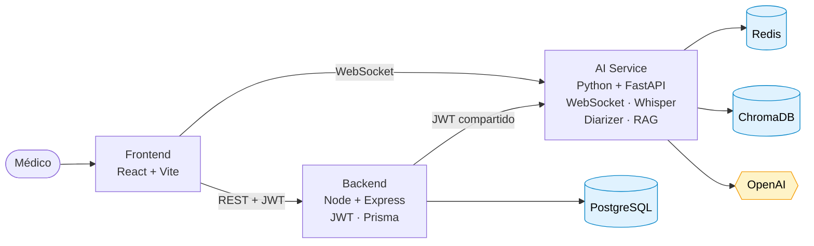
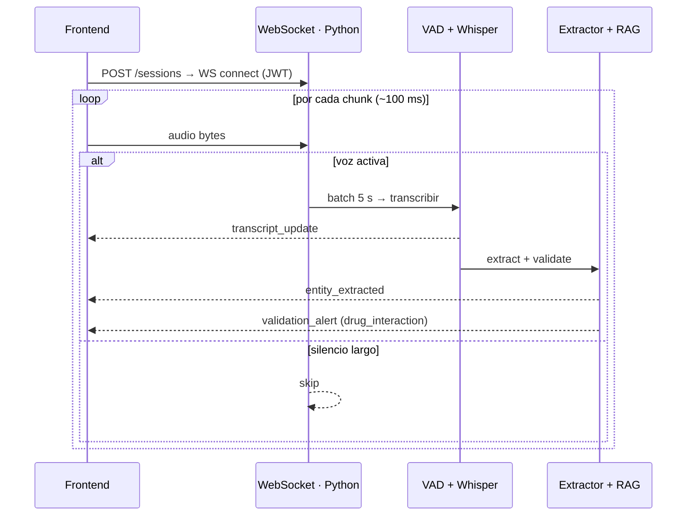

# MedRecord

Documentación médica automatizada en español

  
    Enrique Jiménez · AI/LLM Solution Architect
  

  <carbon-logo-github /> github.com/ejimenezv/health-record

---
layout: center
class: text-center
---

# El problema

30 – 40 %

del tiempo del médico se va en documentación post-consulta

  

    <carbon-document /> Notas SOAP redactadas a mano, horas después
  

  

    <carbon-warning /> Información perdida entre consulta y expediente
  

  

    <carbon-error /> Errores difíciles de auditar
  

  

    <carbon-alarm /> Alertas de interacción que llegan tarde
  

---
layout: center
class: text-center
---

# La propuesta

Transcripción y extracción clínica **en vivo**, mientras la consulta ocurre

  

    <carbon-microphone class="text-3xl text-teal-600 mx-auto" />
    
Audio en vivo

    
WebSocket bidireccional

  

  

    <carbon-text-link-analysis class="text-3xl text-teal-600 mx-auto" />
    
Transcripción

    
Whisper + diarización

  

  

    <carbon-data-vis-1 class="text-3xl text-teal-600 mx-auto" />
    
Extracción

    
Síntomas · CIE-10 · fármacos

  

  

    <carbon-search class="text-3xl text-teal-600 mx-auto" />
    
RAG

    
Vademécum + citaciones

  

  

    <carbon-warning-alt class="text-3xl text-amber-600 mx-auto" />
    
Alertas

    
Interacciones en vivo

  

  Streaming desde el día uno. No es una funcionalidad agregada después.

---
layout: default
---

# Stack tecnológico

  

    
Frontend

    

      <logos-react class="text-5xl" />
      <logos-typescript-icon class="text-5xl" />
      <logos-vitejs class="text-5xl" />
    

    
React · TypeScript · Vite

  

  

    
Backend de negocio

    

      <logos-nodejs-icon class="text-5xl" />
      <logos-express class="text-5xl bg-white p-1 rounded" />
      <logos-prisma class="text-5xl" />
    

    
Node.js · Express · Prisma

  

  

    
Servicio de IA

    

      <logos-python class="text-5xl" />
      <logos-fastapi-icon class="text-5xl" />
      <logos-openai-icon class="text-5xl" />
    

    
Python · FastAPI · OpenAI

  

  

    
Datos e infraestructura

    

      <logos-postgresql class="text-5xl" />
      <logos-redis class="text-5xl" />
      <logos-aws class="text-5xl" />
    

    
PostgreSQL · Redis · ChromaDB · AWS

  

  

    <logos-docker-icon class="text-2xl mx-auto" />
    Docker Compose
  

  

    <logos-terraform-icon class="text-2xl mx-auto" />
    Terraform
  

  

    <carbon-data-base class="text-2xl mx-auto" />
    ChromaDB
  

---
layout: default
---

# Arquitectura — vista de contenedores

  Frontera deliberada: Node.js no toca prompts; Python no toca pacientes.
  JWT HS256 compartido byte-a-byte (ADR-003).

---
layout: default
---

# Demo en vivo — flujo

  
<carbon-checkmark-filled class="text-teal-600" /> 1 · Health checks

  
Backend + AI service responden healthy

  
<carbon-user-avatar class="text-teal-600" /> 2 · Login + dashboard

  
JWT compartido, navegación clínica

  
<carbon-user-multiple class="text-teal-600" /> 3 · Paciente + cita

  
Alergias y crónicas como entidades

  
<carbon-microphone-filled class="text-amber-600" /> 4 · Sesión en vivo

  
WebSocket, transcripción incremental

  
<carbon-collaborate class="text-amber-600" /> 5 · Diarización

  
Doctor / paciente en tiempo real

  
<carbon-data-vis-4 class="text-amber-600" /> 6 · Extracción en vivo

  
Síntomas, dx, CIE-10 candidato

  
<carbon-warning-alt class="text-red-600" /> 7 · Alerta de interacción

  
drug_interaction vía WebSocket

  
<carbon-document-tasks class="text-teal-600" /> 8 · Cierre de sesión

  
Transcripción + extracción consolidadas

  
<carbon-search class="text-teal-600" /> 9 · Consulta RAG

  
POST /query con citaciones

---
layout: section
---

# Decisiones técnicas
## Trade-offs documentados como ADRs

---

# ADR-001 · Estrategia multi-tier de LLMs

  
FAST_CHEAP

  
GPT-4o-mini

  
Validaciones rápidas, validador de diarización lingüística, formato JSON.

  
<logos-openai-icon /> ~ $0.15 / 1M tokens

  
BALANCED · baseline

  
GPT-4o

  
Extracción clínica estructurada, generación principal, CIE-10.

  
<logos-openai-icon /> ~ $2.50 / 1M tokens

  
PREMIUM

  
GPT-4-turbo

  
Fallback para casos complejos o cuando BALANCED falla en JSON.

  
<logos-openai-icon /> ~ $10 / 1M tokens

  Trade-off: GPT-4o-mini es <b>~16× más barato</b> que GPT-4o,
  pero menos preciso en dosis (18 % vs 3 % de error). Por eso GPT-4o queda como
  baseline y mini se usa solo en validaciones secundarias.

---

# ADR-002 · ChromaDB sobre Pinecone

| Opción | Costo / mes | Latencia retrieval | Veredicto |
|---|---|---|---|
| **ChromaDB** (elegido) | $0 (local) | 80 – 120 ms | Suficiente al volumen actual |
| Pinecone | ~$50 starter | 50 – 80 ms | Mejor latencia, pero overkill |
| Weaviate cloud | ~$25 / mes | 60 – 100 ms | Complejidad operacional alta |

  
<carbon-idea class="text-teal-600" /> Por qué

  

    El cuello de botella real es Whisper (~80 s), no el retrieval.
    Optimizar el componente que pesa el 0.1 % del tiempo no tiene sentido.
  

  
<carbon-renew class="text-amber-600" /> Cuándo revisar

  

    Si superamos 80 k vectores, retrieval p95 &gt; 500 ms,
    o necesidad de multi-región / alta disponibilidad.
  

---

# ADR-003 · Node.js + Python con JWT compartido

  

    <logos-nodejs-icon class="text-4xl" />
    
Node.js · dominio clínico

  

  

    Pacientes, citas, expediente, autenticación. Express + Prisma sobre PostgreSQL.
    <b>Deliberadamente delgado en IA</b>: invoca, no orquesta.
  

  

    <logos-python class="text-4xl" />
    
Python · IA

  

  

    Streaming, Whisper, diarización, extracción, RAG, RAGAS, cost tracking.
    Ecosistema sin equivalente real en Node.
  

  
<carbon-password class="text-teal-600" /> JWT HS256 compartido

  

    Un solo token vale en ambos servicios. Secreto byte-a-byte idéntico.
    El frontend autentica una vez; backend y AI service validan
    independientemente.
  

---

# ADR-005 · Diarización híbrida sin GPU

  AudioFeatureDiarizer + LLMValidator + IncrementalDiarizer

  
Streaming (online)

  
~ 87 %

  
precisión · &lt; 2 s por chunk

  
Refinamiento batch al cerrar

  
~ 92 %

  
precisión · + 30 s al cerrar

  

    <b>Pyannote (GPU)</b> — descartado: requiere GPU; en CPU es incompatible con tiempo real.
  

  

    <b>Resemblyzer</b> — descartado: ~80 % de precisión, no mejora baseline.
  

  

    <b>AssemblyAI</b> — descartado: ~$1.50/consulta, 15× el costo objetivo.
  

---

# ADR-006 · Streaming en tiempo real

  Intelligent buffering: voz activa → 5 s · silencio 2-10 s → batch · silencio largo → skip.

---
layout: section
---

# Resultados medidos
## Source-of-truth: <code>docs/delivery-4/</code>

---

# RAGAS · calidad del RAG

  Ejecución 2026-04-30 · 8 preguntas sintéticas validadas · regresión guardrail

  
Faithfulness

  
0.938

  
umbral &gt; 0.80

  
Context Precision

  
1.000

  
umbral &gt; 0.75

  
Answer Relevancy

  
0.964

  
umbral &gt; 0.75

  
Context Recall

  
1.000

  
umbral &gt; 0.70

  <b>Caveat explícito:</b> dataset sintético de 8 preguntas. Es un guardrail
  de regresión, no una prueba de calidad clínica en producción.

---

# Carga y latencia

| Escenario | Métrica | Valor | Objetivo | |
|---|---|---|---|---|
| Persistencia de eventos | Write p95 | **14.45 ms** | &lt; 50 ms | <carbon-checkmark-filled class="text-emerald-600" /> |
| Persistencia de eventos | Throughput | **712 writes/s** | ≥ 50 w/s | <carbon-checkmark-filled class="text-emerald-600" /> |
| Persistencia de eventos | Error rate | **0.00 %** | &lt; 1 % | <carbon-checkmark-filled class="text-emerald-600" /> |
| WebSocket handshake | Latencia mediana | **59 ms** | &lt; 500 ms | <carbon-checkmark-filled class="text-emerald-600" /> |

  <carbon-rocket class="text-emerald-600 text-2xl" />
  
Throughput sostenido

  
14× sobre el objetivo de persistencia.

  <carbon-flash class="text-emerald-600 text-2xl" />
  
Conexión WebSocket instantánea

  
Mediana 8.5× por debajo del límite.

  Fuente: ai-service/reports/2026-04-30/load_test_report.md

---

# Costos

  

    <carbon-checkmark-filled class="text-emerald-600" /> Construido
  

  <ul class="text-sm space-y-2 opacity-90">
    <li>Cost tracker en cada llamada a OpenAI</li>
    <li>Endpoint <code>GET /api/v1/costs</code> con desglose por servicio y modo</li>
    <li>Caching de embeddings en Redis para evitar llamadas redundantes</li>
    <li>Modelo de costos proyectado en <code>delivery-4/02-cost-analysis.md</code></li>
  </ul>

  

    <carbon-warning class="text-amber-600" /> No medido aún
  

  <ul class="text-sm space-y-2 opacity-90">
    <li>Costo promedio observado sobre sesiones reales completadas</li>
    <li>Reconciliación con facturación AWS (<b>OI-5</b>)</li>
    <li>Dashboard de costos en el frontend</li>
  </ul>

  <b>Honestidad:</b> la cifra <b>$0.25 – 0.28 por consulta</b> en tiempo real
  es del modelo de costos, no un promedio observado. La reconciliación con
  AWS y la visualización son trabajo de v2.

---
layout: section
---

# Reflexión
## Lo que funcionó · lo pendiente · lecciones

---

# Lo que funcionó

  <carbon-checkmark-filled class="text-emerald-600 text-2xl mt-1" />
  

    
Multi-tier LLM (ADR-001)

    
GPT-4o donde importa, mini para validaciones secundarias.

  

  <carbon-checkmark-filled class="text-emerald-600 text-2xl mt-1" />
  

    
ChromaDB local (ADR-002)

    
Cero costo operacional, latencia suficiente al volumen actual.

  

  <carbon-checkmark-filled class="text-emerald-600 text-2xl mt-1" />
  

    
Diarización híbrida (ADR-005)

    
87 % streaming · 92 % batch · sin GPU.

  

  <carbon-checkmark-filled class="text-emerald-600 text-2xl mt-1" />
  

    
Streaming desde día uno (ADR-006)

    
Habilitó alertas en cuanto se detectan, no después.

  

  <carbon-checkmark-filled class="text-emerald-600 text-2xl mt-1" />
  

    
RAGAS como guardrail de regresión

    
Integrado al ciclo de desarrollo, no añadido al final.

  

---

# Lo que quedó pendiente

  <carbon-warning-alt class="text-red-600 text-2xl mt-1" />
  

    
Generación automática del borrador SOAP

    
Modelo de datos listo, orquestación pendiente para v2.

  

  <carbon-warning-alt class="text-red-600 text-2xl mt-1" />
  

    
Dependencia de la API de Whisper

    
Latencia y costo variable; <code>faster-whisper</code> local es la migración candidata.

  

  <carbon-warning-alt class="text-red-600 text-2xl mt-1" />
  

    
Sin dashboard de costos en el frontend

    
El endpoint backend existe; falta la UI.

  

  <carbon-warning-alt class="text-red-600 text-2xl mt-1" />
  

    
Sin Grafana / Prometheus

    
Solo logs estructurados y métricas in-process.

  

  <carbon-warning-alt class="text-red-600 text-2xl mt-1" />
  

    
Reconciliación con facturación AWS (OI-5)

    
Pendiente para v2.

  

---

# Lecciones aprendidas

  
<carbon-edit />

  
Prompt > fine-tuning en MVP

  

    Few-shot prompting llega antes y más barato. Fine-tuning solo si el caso lo justifica.
  

  
<carbon-currency-dollar />

  
Cost tracking es un RNF

  

    Se instrumenta primero. La interfaz puede esperar; los datos no.
  

  
<carbon-microscope />

  
RAGAS detecta lo que tests no

  

    Faithfulness es la propiedad que importa en dominio clínico.
  

  
<carbon-flash />

  
Streaming se diseña, no se retrofitea

  

    VAD, buffering, entity matching y reconexión solo encajan limpios desde el día uno.
  

---

# Roadmap v2

  

    <carbon-flag /> Prioridad alta · 1 – 3 meses
  

  <ul class="space-y-3 text-sm">
    <li class="p-3 rounded bg-red-50 border border-red-200">
      <b>Generación automática del borrador SOAP</b> 
      Completa el contrato "el médico cierra y la documentación está hecha"
    </li>
    <li class="p-3 rounded bg-red-50 border border-red-200">
      <b>Migración a faster-whisper local</b> 
      −40 % latencia + elimina costo variable de la API
    </li>
    <li class="p-3 rounded bg-red-50 border border-red-200">
      <b>Dashboard de costos + observabilidad</b> 
      Frontend para /api/v1/costs · Langfuse · Grafana
    </li>
  </ul>

  

    <carbon-time /> Medio · largo plazo · 3 – 12 meses
  

  <ul class="space-y-3 text-sm">
    <li class="p-3 rounded bg-amber-50 border border-amber-200">
      <b>Multi-tenancy con auth federada</b> 
      Azure AD / Cognito · separación estricta de datos
    </li>
    <li class="p-3 rounded bg-amber-50 border border-amber-200">
      <b>Soporte multimodal</b> 
      GPT-4-vision para radiografías y fotos clínicas
    </li>
    <li class="p-3 rounded bg-amber-50 border border-amber-200">
      <b>Alertas clínicas más ricas</b> 
      Cruzando historial completo del paciente
    </li>
  </ul>

---
layout: cover
background: https://images.unsplash.com/photo-1551288049-bebda4e38f71?auto=format&fit=crop&w=1920&q=70
class: text-center
---

# Gracias

MedRecord — documentación médica automatizada en español

  

    <carbon-logo-github />
    <a href="https://github.com/ejimenezv/health-record" class="underline">github.com/ejimenezv/health-record</a>
  

  

    <carbon-document />
    docs/delivery-4/ · docs/adr/
  

  Enrique Jiménez · AI/LLM Solution Architect

