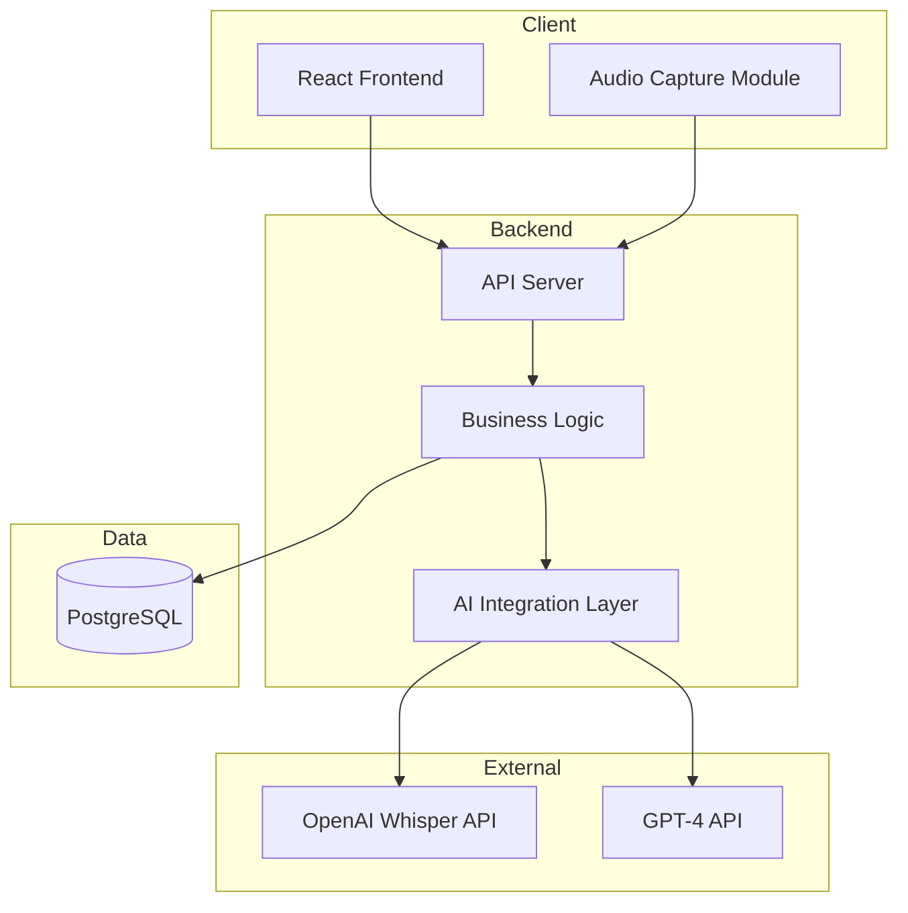

# Prompt 03: System Architecture Definition

## Context
You are helping develop a Medical Record System MVP for a final project in the AI4Devs course. This is the FOURTH prompt in the series. Previous prompts completed research, product definition, and user stories.

## Prerequisites
Before proceeding, read the following files:
- `docs/product/features.md`
- `docs/product/mvp-scope.md`
- `docs/stories/must-have-stories.md`
- `docs/stories/story-map.md`
- `docs/stories/stories-summary.md`
- `docs/research/ai-transcription-approach.md`

## Objective
Design the complete system architecture for the Medical Record System MVP. This architecture must support all defined user stories, particularly the real-time AI transcription and auto-fill features.

## System Requirements Summary
Based on previous documentation:
- Web application accessible via browser
- Single doctor user (simplified auth for MVP)
- Real-time audio capture and transcription
- Real-time UI updates as transcription progresses
- PostgreSQL or similar relational database
- RESTful API backend
- Modern frontend framework

## Tasks

### 1. High-Level Architecture Design
Create `docs/architecture/high-level-architecture.md` with:

**Architecture Pattern Selection**:
- Choose and justify the architectural pattern (e.g., Monolithic, Layered, Clean Architecture)
- Explain why this pattern fits the MVP requirements
- Document trade-offs and alternatives considered

**System Components**:
```
[Client] <---> [API Gateway/Backend] <---> [Database]
    |                  |
    |                  v
    |         [AI Services]
    |              |
    v              v
[Audio Capture] [Transcription API]
```

Include:
- Component responsibilities
- Communication protocols
- Data flow descriptions

### 2. Create Architecture Diagram
Create `docs/architecture/diagrams/` folder with:

**Main Architecture Diagram** (`system-architecture.md`):
Use Mermaid diagram syntax:


**Sequence Diagrams** for key flows:
- Patient registration flow
- Create appointment flow
- AI transcription flow (most complex)
- Auto-fill medical record flow

### 3. Define Component Architecture
Create `docs/architecture/components.md` with:

**Frontend Components**:
- Routing structure
- State management approach
- Component hierarchy overview
- Audio handling approach

**Backend Components**:
- API layer structure
- Service layer structure
- Data access layer structure
- AI integration services

**Database Components**:
- Tables/entities overview
- Relationships overview
- Indexing considerations

### 4. Define Integration Architecture
Create `docs/architecture/integrations.md` with:

**AI Service Integration**:
- OpenAI API integration details
- Whisper API for transcription
- GPT-4 for field extraction
- Rate limiting considerations
- Error handling approach
- Fallback strategies

**Real-time Communication**:
- WebSocket vs Polling decision
- How real-time updates flow
- Client-server sync approach

### 5. Define Security Architecture
Create `docs/architecture/security.md` with:
- Authentication approach (JWT recommended for MVP)
- Authorization model
- Data protection considerations
- API security (CORS, rate limiting)
- Secrets management approach
- HTTPS requirements

### 6. Define Infrastructure Architecture
Create `docs/architecture/infrastructure.md` with:
- Development environment setup
- Deployment architecture (Ubuntu server)
- Container strategy (Docker recommended)
- CI/CD pipeline approach
- Environment configuration

### 7. Technology Decisions Summary
Create `docs/architecture/tech-decisions.md` with:
- Summary of all technology choices
- Justification for each choice
- Alternatives considered
- Decision matrix if helpful

### 8. Fill Template Section 2 (Spanish)
Create `docs/deliverables/section-2-arquitectura.md` with the content for Section 2 of `plantilla-de-trabajo.md` in Spanish:

```markdown
## 2. Arquitectura del Sistema

### 2.1. Diagrama de arquitectura:
[Include Mermaid diagram]

**Patrón arquitectónico**: [Describe pattern selected]

**Justificación**: [Explain why this architecture was chosen]

**Beneficios**:
- [Benefit 1]
- [Benefit 2]

**Trade-offs**:
- [Trade-off 1]
- [Trade-off 2]

### 2.2. Descripción de componentes principales:

#### Frontend (React/TypeScript)
[Description in Spanish]

#### Backend (Node.js/Express)
[Description in Spanish]

#### Base de Datos (PostgreSQL)
[Description in Spanish]

#### Servicios de IA (OpenAI)
[Description in Spanish]

### 2.3. Descripción de alto nivel del proyecto y estructura de ficheros
[High-level structure description - will be detailed after project setup]

### 2.4. Infraestructura y despliegue
[Deployment architecture description]
[Include infrastructure diagram if applicable]

### 2.5. Seguridad
[Security practices enumerated in Spanish]
- Autenticación: [Description]
- Autorización: [Description]
- Protección de datos: [Description]
- Seguridad de API: [Description]

### 2.6. Tests
[Brief description of testing approach - will be detailed later]
```

### 9. Create Architecture Summary
Create `docs/architecture/architecture-summary.md` with:
- Quick reference architecture overview
- Key decisions list
- Component list with technologies
- Integration points
- Ready-for-implementation checklist

## Output Structure
```
docs/
├── research/           (from prompt 00)
├── product/            (from prompt 01)
├── stories/            (from prompt 02)
├── architecture/
│   ├── high-level-architecture.md
│   ├── components.md
│   ├── integrations.md
│   ├── security.md
│   ├── infrastructure.md
│   ├── tech-decisions.md
│   ├── architecture-summary.md
│   └── diagrams/
│       ├── system-architecture.md
│       └── sequence-diagrams.md
└── deliverables/
    ├── section-1-producto.md
    ├── section-2-arquitectura.md
    └── section-5-historias.md
```

## Success Criteria
- High-level architecture defined and justified
- All diagrams created using Mermaid syntax
- Component responsibilities clearly defined
- AI integration architecture detailed
- Security architecture documented
- Infrastructure and deployment approach defined
- Section 2 content ready in Spanish
- Architecture summary created for quick reference

## Next Prompt
The next prompt (04-tech-stack.md) will finalize the specific technology stack based on this architecture.
