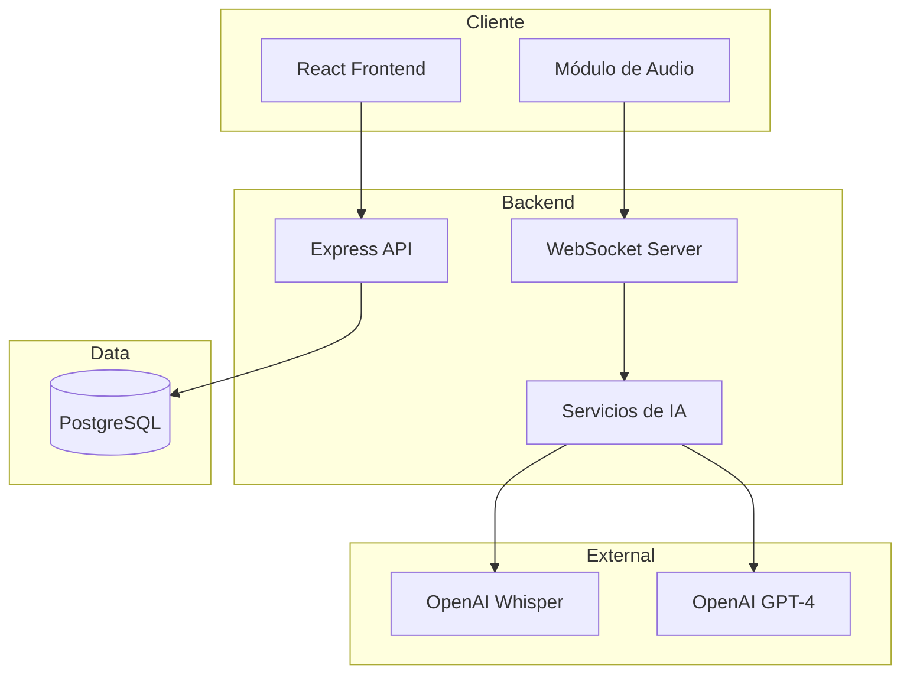

# Prompt 21: Project Delivery - Fill plantilla-de-trabajo.md

## Context
This is the FINAL prompt for the Medical Record System MVP. All implementation and documentation is complete. Now we fill the final project template.

## Prerequisites
Read all files in `docs/deliverables/`:
- `section-1-producto.md`
- `section-2-arquitectura.md`
- `section-3-modelo-datos.md`
- `section-4-api.md`
- `section-5-historias.md`
- `section-6-tickets.md`
- `section-7-prs.md`

Also read:
- `README.md`
- `prompts.md`

## Objective
Complete the `plantilla-de-trabajo.md` file with all project information in Spanish, ready for submission.

## Tasks

### 1. Fill Complete Template

Read the current `plantilla-de-trabajo.md` template and fill ALL sections by consolidating content from the deliverables folder. Create the final file.

### Fill Section 0: Ficha del Proyecto
```markdown
## 0. Ficha del proyecto

### **0.1. Tu nombre completo:**
[FILL WITH YOUR NAME]

### **0.2. Nombre del proyecto:**
MedRecord AI - Sistema de Historial Médico con IA

### **0.3. Descripción breve del proyecto:**
Sistema de gestión de historiales médicos para médicos que permite registrar citas,
documentar síntomas/diagnósticos/recetas, y utiliza IA para transcribir consultas
de hasta 60 minutos y auto-llenar campos médicos en tiempo real.

### **0.4. URL del proyecto:**
https://medrecord-ai.tu-dominio.com
(O indicar si es privado y cómo acceder)

### 0.5. URL o archivo comprimido del repositorio
https://github.com/TU_USUARIO/health-record
```

### Fill Section 1: Descripción del Producto
Consolidate from `docs/deliverables/section-1-producto.md`

### Fill Section 2: Arquitectura
Consolidate from `docs/deliverables/section-2-arquitectura.md`

Include the Mermaid diagram:


### Fill Section 3: Modelo de Datos
Consolidate from `docs/deliverables/section-3-modelo-datos.md`

Include the complete ER diagram in Mermaid format with all entities.

### Fill Section 4: API
Consolidate from `docs/deliverables/section-4-api.md`

Include the 3 main endpoints with complete request/response examples.

### Fill Section 5: Historias de Usuario
Consolidate from `docs/deliverables/section-5-historias.md`

Include the 3 main user stories with acceptance criteria.

### Fill Section 6: Tickets
Consolidate from `docs/deliverables/section-6-tickets.md`

Include 3 tickets: one backend, one frontend, one database.

### Fill Section 7: Pull Requests
Consolidate from `docs/deliverables/section-7-prs.md`

Include 3 significant pull requests.

### 2. Final Review Checklist

Before submission, verify:

**Documentation Quality:**
- [ ] All sections filled in Spanish
- [ ] Mermaid diagrams render correctly
- [ ] Code examples are properly formatted
- [ ] Screenshots included or placeholder noted

**Technical Accuracy:**
- [ ] Architecture matches implementation
- [ ] Data model matches Prisma schema
- [ ] API spec matches actual endpoints
- [ ] All features documented accurately

**Completeness:**
- [ ] Sections 0-7 all complete
- [ ] prompts.md complete with AI usage
- [ ] README.md complete
- [ ] Installation instructions tested

### 3. Create Submission Package

Verify the following files are ready:

```
health-record/
├── README.md               ✓ Complete
├── plantilla-de-trabajo.md ✓ Filled (this file)
├── prompts.md              ✓ Complete
├── packages/
│   ├── backend/           ✓ Implemented
│   └── frontend/          ✓ Implemented
├── docker/                 ✓ Configured
├── docs/
│   ├── screenshots/       ✓ With images
│   └── ...
└── .github/workflows/     ✓ CI/CD configured
```

### 4. Git Branch and Tag

Create final branch and tag:
```bash
# Create final branch
git checkout -b finalproject-[INICIALES]

# Ensure everything is committed
git add .
git commit -m "docs: complete project delivery documentation"

# Create release tag
git tag -a v1.0-final-[INICIALES] -m "Final project release for AI4Devs"

# Push branch and tag
git push origin finalproject-[INICIALES]
git push origin v1.0-final-[INICIALES]
```

### 5. Submission Steps

1. **Verify deployment** (if applicable):
   - Application accessible at public URL
   - OR video demo recorded
   - OR screenshots captured

2. **Repository access**:
   - If public: verify URL works
   - If private: share access with TA

3. **Fill Typeform**:
   - Go to https://lidr.typeform.com/proyectoai4devs
   - Include branch URL: `finalproject-[INICIALES]`

## Final plantilla-de-trabajo.md Content

Here's the structure of your final filled template. Replace placeholders with your actual content:

```markdown
## Índice

0. [Ficha del proyecto](#0-ficha-del-proyecto)
1. [Descripción general del producto](#1-descripción-general-del-producto)
2. [Arquitectura del sistema](#2-arquitectura-del-sistema)
3. [Modelo de datos](#3-modelo-de-datos)
4. [Especificación de la API](#4-especificación-de-la-api)
5. [Historias de usuario](#5-historias-de-usuario)
6. [Tickets de trabajo](#6-tickets-de-trabajo)
7. [Pull requests](#7-pull-requests)

---

## 0. Ficha del proyecto

### **0.1. Tu nombre completo:**
[TU NOMBRE]

### **0.2. Nombre del proyecto:**
MedRecord AI

### **0.3. Descripción breve del proyecto:**
Sistema de historial médico con transcripción automática de citas mediante IA.
Permite a médicos gestionar pacientes, registrar citas, y documentar síntomas,
diagnósticos y recetas. La IA transcribe consultas de hasta 60 minutos y
auto-llena campos médicos en tiempo real.

### **0.4. URL del proyecto:**
[URL O INSTRUCCIONES DE ACCESO]

### 0.5. URL o archivo comprimido del repositorio
[URL DEL REPOSITORIO]

---

## 1. Descripción general del producto

[CONTENT FROM section-1-producto.md]

---

## 2. Arquitectura del Sistema

[CONTENT FROM section-2-arquitectura.md]

---

## 3. Modelo de Datos

[CONTENT FROM section-3-modelo-datos.md]

---

## 4. Especificación de la API

[CONTENT FROM section-4-api.md]

---

## 5. Historias de Usuario

[CONTENT FROM section-5-historias.md]

---

## 6. Tickets de Trabajo

[CONTENT FROM section-6-tickets.md]

---

## 7. Pull Requests

[CONTENT FROM section-7-prs.md]
```

## Commit
```bash
git add .
git commit -m "docs: complete final project template

- Fill all sections of plantilla-de-trabajo.md
- Consolidate all documentation
- Ready for submission

Final project delivery for AI4Devs course"
```

## Final Checklist

- [ ] plantilla-de-trabajo.md complete in Spanish
- [ ] prompts.md complete
- [ ] README.md complete
- [ ] All code implemented and tested
- [ ] Deployment configured (or demo video ready)
- [ ] Branch finalproject-[INICIALES] created
- [ ] Tag v1.0-final-[INICIALES] created
- [ ] Pushed to remote
- [ ] Repository accessible to TA
- [ ] Typeform submitted

## Congratulations!

Your Medical Record System MVP with AI transcription is complete. The project demonstrates:

1. **End-to-end development** with modern stack
2. **AI integration** for real value (transcription + extraction)
3. **Full documentation** covering all project aspects
4. **Professional practices** (testing, CI/CD, deployment)
5. **Effective use of AI tools** throughout development

Good luck with your submission!
